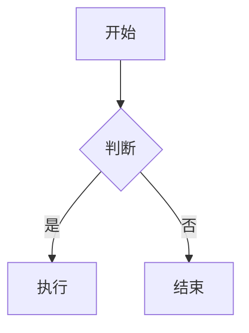

# md2journal

Markdown → 中文期刊 PDF 批量自动转换工具。

支持 Markdown + LaTeX 公式 + Mermaid 图表，输出符合中文期刊排版规范的 PDF。

## 特性

- **中文期刊排版** — 宋体正文、黑体标题、三线表、首行缩进，符合学术期刊规范
- **LaTeX 公式** — 基于 KaTeX，支持行内 `$...$` 和行间 `$$...$$` 公式
- **Mermaid 图表** — 流程图、状态图、时序图等，直接嵌入 Markdown
- **YAML 元信息** — 通过 front-matter 定义标题、作者、摘要、关键词
- **三种运行模式** — 单文件转换、批量构建、监听自动转换
- **离线优先** — 自动内联本地 KaTeX/Mermaid 资源，无需网络即可使用
- **可定制样式** — 通过 `--css` 参数加载自定义样式文件
- **多样式输出** — 一次转换生成多种样式的 PDF（`--all-styles`、`--preset`）
- **灵活文件选择** — 通配符匹配、排除模式、递归控制

## 环境要求

- **Node.js** >= 18
- 系统需安装中文字体（macOS 自带宋体/黑体/楷体，Linux 需安装 `fonts-noto-cjk`）

## 快速开始

```bash
# 安装依赖
npm install

# 运行示例
npm run demo

# 单文件转换
node cli.js file input.md output.pdf

# 批量转换（目录中所有 .md → .pdf）
node cli.js build ./input ./output

# 监听模式（文件变动自动转换）
node cli.js watch ./input ./output
```

## Markdown 文件格式

### YAML Front-matter

在 `.md` 文件头部定义文章元信息，所有字段均为可选：

```yaml
---
title: "论文标题"
author: "作者一，作者二"
date: "2026年2月"
abstract: "摘要内容..."
keywords:
  - 关键词1
  - 关键词2
---

# 正文从这里开始
```

各字段说明：

| 字段 | 类型 | 说明 |
|------|------|------|
| `title` | string | 文章标题，居中显示于页面顶部 |
| `author` | string | 作者列表，以中文逗号分隔 |
| `date` | string | 日期，自由格式 |
| `abstract` | string | 摘要正文 |
| `keywords` | string[] | 关键词数组，输出时以中文分号连接 |

### LaTeX 公式

行内公式用 `$...$`，行间公式用 `$$...$$`：

```
行内：能量公式 $E = mc^2$ 表示...

行间：
$$\int_0^\infty e^{-x^2} dx = \frac{\sqrt{\pi}}{2}$$
```

如需在文本中显示美元符号本身，使用反斜杠转义：`\$100`。

### Mermaid 图表

使用 ` ```mermaid ` 代码块，支持流程图、状态图、时序图等所有 Mermaid 图表类型：

````

````

### 标准 Markdown

支持所有 GFM（GitHub Flavored Markdown）语法，包括表格、任务列表、删除线、代码块语法高亮等。

## CLI 参数

### 公共选项（所有命令通用）

```
-c, --css <path>              CSS 样式（内置名或文件路径，可多次指定）
    --all-styles              使用所有内置样式
    --preset <name>           使用样式预设 (academic|notes|report|all)
    --output-pattern <pat>    输出路径模板 ({name}, {style}, {dir}, {ext})
```

### 命令

```
md2journal file <input> [output]
  （公共选项同上）

md2journal build <inputDir> <outputDir>
  -j, --concurrency <n>      并发数量（默认 3）
      --exclude <pattern>     排除文件模式（可多次指定）
      --no-recursive          不递归扫描子目录
  （公共选项同上）

md2journal watch <inputDir> <outputDir>
  （公共选项同上）
```

### 命令说明

**`file`** — 将 `.md` 文件转换为 `.pdf`。支持通配符（如 `"*.md"`）批量匹配。多样式时 `output` 作为输出目录，按样式名创建子目录。

**`build`** — 递归扫描输入目录中所有 `.md` 文件并批量转换，保持目录结构。通过 `-j` 调整并发数，文件较多时可适当增大。支持 `--exclude` 排除特定文件，`--no-recursive` 仅处理顶层文件。

**`watch`** — 监听输入目录，文件新增或修改时自动触发转换。支持多样式同时输出。内部维护串行队列，同一文件多次修改会自动去重。预启动浏览器实例避免重复启动开销，浏览器异常断开时自动重连。按 `Ctrl+C` 优雅退出。

## 自定义样式

默认使用内置的 `journal.css`，遵循中文学术期刊排版规范。可通过 `--css` 参数指定自定义样式：

```bash
node cli.js build ./input ./output --css ./my-style.css
```

### 内置样式

| 样式文件 | 内置名 | 说明 |
|---------|--------|------|
| `journal.css` | `journal` | 中文学术期刊排版（默认），宋体正文、三线表、首行缩进 |
| `cornell-notes.css` | `cornell-notes` | 康奈尔笔记样式，B5 内容区 + A4 页面笔记留白，自然绿系配色 |
| `normal-a4.css` | `normal-a4` | 常规 A4 全幅排版，自然绿系配色，适合通用文档输出 |

使用内置名时无需写文件路径：

```bash
# 使用内置名
node cli.js file input.md output.pdf --css cornell-notes
node cli.js file input.md output.pdf --css normal-a4
```

### 多样式输出

一次转换生成多种样式的 PDF，输出按样式名自动创建子目录：

```bash
# 使用所有内置样式
node cli.js file input.md ./output --all-styles
# 输出: output/journal/input.pdf
#       output/cornell-notes/input.pdf
#       output/normal-a4/input.pdf

# 使用样式预设
node cli.js build ./input ./output --preset all

# 指定多个样式
node cli.js file input.md ./output --css journal --css normal-a4

# 自定义输出命名模式
node cli.js file input.md ./output --all-styles --output-pattern "{name}-{style}{ext}"
# 输出: output/input-journal.pdf, output/input-cornell-notes.pdf, ...
```

### 样式预设

| 预设名 | 包含样式 | 适用场景 |
|--------|---------|---------|
| `academic` | journal | 学术论文 |
| `notes` | cornell-notes | 课堂/学习笔记 |
| `report` | normal-a4 | 通用报告 |
| `all` | journal, cornell-notes, normal-a4 | 全部样式 |

### 文件选择选项（build 命令）

```bash
# 排除特定文件
node cli.js build ./input ./output --exclude "drafts/**" --exclude "*.wip.md"

# 仅处理顶层文件（不递归子目录）
node cli.js build ./input ./output --no-recursive

# 通配符匹配（file 命令）
node cli.js file "docs/*.md" ./output
```

### 默认排版规范

| 元素 | 样式 |
|------|------|
| 正文 | 宋体 10.5pt，行高 1.75，两端对齐，首行缩进 2em |
| 标题 | 黑体，H1: 15pt / H2: 13pt / H3: 11.5pt |
| 摘要 | 9.5pt，左右缩进 2em |
| 表格 | 三线表（顶线、表头线、底线），9.5pt |
| 代码块 | 等宽字体 9pt，灰色背景 |
| 页码 | 页脚居中，格式 `当前页 / 总页数` |
| 纸张 | A4，边距上下 2.5cm、左右 2.2cm |

## 转换流程

```
Markdown 文件
    ↓ gray-matter
YAML 元信息 + Markdown 正文
    ↓ marked (GFM)
HTML 片段
    ↓ KaTeX
LaTeX 公式渲染为 HTML
    ↓ buildHtml
完整 HTML 文档（内联 CSS + JS）
    ↓ Puppeteer
PDF 文件（A4 / 分页 / 页码）
```

## 项目结构

```
md2journal/
├── cli.js           # CLI 入口，提供 file / build / watch 三个命令
├── converter.js     # 核心转换引擎（解析、渲染、PDF 生成）
├── journal.css      # 中文期刊默认样式
├── cornell-notes.css # 康奈尔笔记样式（B5 内容区 + A4 笔记留白）
├── normal-a4.css    # 常规 A4 全幅排版样式（清新自然绿系配色）
├── package.json
├── README.md
└── demo/
    └── sample.md    # 示例文件（NLP 综述论文）
```

## 依赖说明

| 包 | 用途 |
|----|------|
| [marked](https://github.com/markedjs/marked) | Markdown → HTML 解析 |
| [katex](https://github.com/KaTeX/KaTeX) | LaTeX 公式渲染 |
| [puppeteer](https://github.com/puppeteer/puppeteer) | 无头浏览器驱动，HTML → PDF |
| [gray-matter](https://github.com/jonschlinkert/gray-matter) | YAML front-matter 解析 |
| [chokidar](https://github.com/paulmillr/chokidar) | 文件系统监听（watch 模式） |
| [commander](https://github.com/tj/commander.js) | CLI 命令行框架 |
| [chalk](https://github.com/chalk/chalk) | 终端彩色输出 |
| [glob](https://github.com/isaacs/node-glob) | 文件模式匹配 |

## 常见问题

### Puppeteer 启动失败

首次运行时 Puppeteer 会自动下载 Chromium。如果网络受限，可设置镜像：

```bash
PUPPETEER_DOWNLOAD_BASE_URL=https://registry.npmmirror.com/-/binary/chromium-browser-snapshots npm install
```

### 中文字体缺失（Linux）

Linux 环境下需安装中文字体：

```bash
# Ubuntu / Debian
sudo apt install fonts-noto-cjk

# CentOS / RHEL
sudo yum install google-noto-sans-cjk-fonts
```

### Mermaid 图表未渲染

Mermaid 通过 CDN 加载。如需离线使用，安装 mermaid 为本地依赖，工具会自动内联：

```bash
npm install mermaid
```

### 转换超时

大型文档或复杂 Mermaid 图表可能需要更长时间。如遇超时，可尝试：
- 简化 Mermaid 图表复杂度
- 减少单个文件中的图表数量
- 确保网络畅通（CDN 模式下）

## 许可证

本项目基于 [Apache License 2.0](./LICENSE) 开源。

---

**Apache License 2.0 要点:**
- 可自由使用、修改、分发本项目
- 需保留原作者版权声明
- 分发时需附带许可证全文
- 本项目按"现状"提供,无任何保证

MIT
