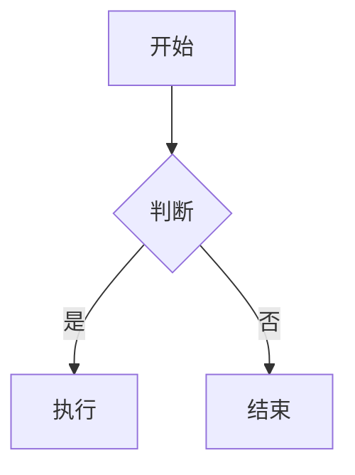

# md2journal

Markdown → Chinese Academic Journal PDF Converter

Convert Markdown (with LaTeX + Mermaid) to PDF documents formatted for Chinese academic journals.

## Features

- **Chinese Journal Layout** — Serif body, sans-serif headings, three-line tables, first-line indent, compliant with academic journal standards
- **LaTeX Formulas** — Based on KaTeX, supports inline `$...$` and display `$$...$$` formulas
- **Mermaid Diagrams** — Flowcharts, state diagrams, sequence diagrams, embedded directly in Markdown
- **YAML Metadata** — Define title, author, abstract, keywords via front-matter
- **Three Running Modes** — Single file conversion, batch build, watch mode for auto-conversion
- **Offline-First** — Automatically inlines local KaTeX/Mermaid resources, works without internet
- **Customizable Styles** — Load custom styles via `--css` flag
- **Multi-Style Output** — Generate multiple PDF styles in one conversion (`--all-styles`, `--preset`)
- **Flexible File Selection** — Wildcard matching, exclusion patterns, recursive control

## Requirements

- **Node.js** >= 18
- System requires Chinese fonts (macOS comes with Songti/SimHei/Kaiti, Linux needs `fonts-noto-cjk`)

## Quick Start

```bash
# Install dependencies
npm install

# Run demo
npm run demo

# Single file conversion
node cli.js file input.md output.pdf

# Batch conversion (all .md → .pdf)
node cli.js build ./input ./output

# Watch mode (auto-convert on file change)
node cli.js watch ./input ./output
```

## Markdown Format

### YAML Front-matter

Define article metadata at the top of `.md` file, all fields are optional:

```yaml
---
title: 文章标题
author: 作者姓名
date: 2024-01-01
abstract: 摘要内容
keywords: [关键词1, 关键词2, 关键词3]
---
```

### LaTeX Formulas

```markdown
行内公式: $E = mc^2$

行间公式:
$$
\int_{-\infty}^{\infty} e^{-x^2} dx = \sqrt{\pi}
$$
```

### Mermaid Diagrams

````markdown

````

## CLI Commands

### Single File Conversion

```bash
node cli.js file <input.md> <output.pdf> [options]
```

Options:
- `--css <path>` — Custom CSS file
- `--style <name>` — Built-in style (journal/cornell-notes/normal-a4)

### Batch Build

```bash
node cli.js build <inputDir> <outputDir> [options]
```

Options:
- `--css <path>` — Custom CSS file
- `--all-styles` — Generate all 3 PDF styles
- `--preset <name>` — Style preset (academic/all)
- `--pattern <glob>` — File matching pattern (default: `**/*.md`)
- `--exclude <glob>` — Exclusion pattern
- `--concurrency <n>` — Concurrent conversions (default: 3)

### Watch Mode

```bash
node cli.js watch <inputDir> <outputDir> [options]
```

Same options as batch build. Auto-converts when files change.

## Built-in Styles

| Style | Description |
|-------|-------------|
| `journal` | Academic journal format - serif body, three-line tables |
| `cornell-notes` | Cornell notes format - B5 content area + A4 margin |
| `normal-a4` | General A4 layout - full-width A4 output |

## GUI Mode

Launch web interface for visual operation:

```bash
npm run gui
# or
node gui.js --port 3456
```

Access at: http://localhost:3456

## Configuration Files

Support YAML configuration file (e.g., `.md2journal.yaml`):

```yaml
input: ./input
output: ./output
style: journal
allStyles: true
exclude:
  - "**/draft/**"
  - "**/TODO.md"
```

## Dependencies

| Package | Purpose |
|---------|---------|
| [marked](https://github.com/markedjs/marked) | Markdown parsing |
| [katex](https://github.com/KaTeX/KaTeX) | LaTeX formula rendering |
| [mermaid](https://github.com/mermaid-js/mermaid) | Diagram generation |
| [puppeteer](https://github.com/puppeteer/puppeteer) | PDF rendering |
| [gray-matter](https://github.com/jonschlinkert/gray-matter) | YAML front-matter parsing |
| [chokidar](https://github.com/paulmillr/chokidar) | File system watching |
| [commander](https://github.com/tj/commander.js) | CLI framework |

## Development Commands

```bash
npm test            # Run tests (Vitest)
npm run test:run  # Quick test run
npm run lint      # ESLint check
npm run format    # Prettier formatting
```

## License

Apache License 2.0 - See [LICENSE](./LICENSE) file.

## GitHub

https://github.com/one1d/md2journal
