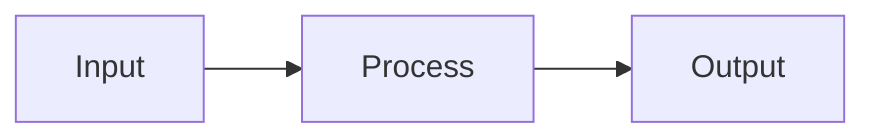

# md2journal

<p align="center">
  <strong>Markdown → Chinese Academic Journal PDF Converter</strong>
</p>

<p align="center">
  <a href="https://www.npmjs.com/package/md2journal">
    
  </a>
  <a href="https://github.com/one1d/md2journal/actions">
    
  </a>
  <a href="https://nodejs.org/">
    
  </a>
  <a href="./LICENSE">
    
  </a>
</p>

## Overview

md2journal is a Node.js CLI tool that converts Markdown files (with LaTeX formulas and Mermaid diagrams) into PDF documents formatted for Chinese academic journals. It supports three operation modes: single file conversion, batch build, and watch mode for auto-conversion.

**Supports: Windows | macOS | Linux**

## Features

- 📝 **Full Markdown Support** — GFM syntax, code highlighting, tables, task lists
- 🔬 **LaTeX Formulas** — KaTeX-powered, inline `$...$` and display `$$...$$` syntax
- 📊 **Mermaid Diagrams** — Flowcharts, state diagrams, sequence diagrams, class diagrams
- 📰 **Chinese Journal Layout** — Serif body, sans-serif headings, three-line tables, first-line indent
- 🎨 **Multi-Style Output** — Academic journal, Cornell notes, standard A4 formats
- 👁️ **GUI Mode** — Browser-based visual interface
- 🌐 **Cross-Platform** — Windows, macOS, Linux fully supported
- ⚡ **High Performance** — Browser pooling, vendor caching, parallel processing

## Installation

### Prerequisites

| Requirement | Version |
|-------------|---------|
| Node.js | ≥ 18.0.0 |
| npm | ≥ 9.0.0 |

### Option 1: Install via npm (Recommended)

```bash
# Global installation
npm install -g md2journal

# Verify installation
md2journal --version

# Or use npx
npx md2journal --version
```

### Option 2: Local Installation

```bash
# Clone repository
git clone https://github.com/one1d/md2journal.git
cd md2journal

# Install dependencies
npm install

# Run directly
node cli.js --version
```

### Option 3: Binary Distribution (Coming Soon)

Download pre-built binaries for your platform from the [Releases](https://github.com/one1d/md2journal/releases) page.

## Quick Start

### CLI Usage

```bash
# Single file conversion
md2journal file input.md output.pdf

# Batch conversion (directory)
md2journal build ./input ./output

# Watch mode (auto-convert on file change)
md2journal watch ./input ./output
```

### GUI Usage

```bash
# Start GUI server (default port 3456)
md2journal-gui

# Or use npx
npx md2journal-gui

# Custom port
npx md2journal-gui --port 3000

# Then open http://localhost:3456 in your browser
```

### npm Scripts

```bash
# Convert demo files
npm run demo

# Build input files
npm run build

# Watch mode
npm run watch

# Generate all styles
npm run build:all
```

## Command Reference

### `md2journal file <input> [output]`

Convert a single Markdown file to PDF.

| Option | Alias | Description | Default |
|--------|-------|-------------|---------|
| `--css <name>` | `-c` | CSS style name | `journal` |
| `--all-styles` | `-a` | Generate all 3 styles | `false` |
| `--preset <name>` | `-p` | Preset name | - |
| `--output-pattern <pattern>` | `-o` | Output filename pattern | `{name}.pdf` |

**Styles:** `journal`, `cornell-notes`, `normal-a4`

**Examples:**
```bash
# Convert with default style
md2journal file input.md output.pdf

# Convert with Cornell notes style
md2journal file input.md output.pdf --css cornell-notes

# Generate all styles
md2journal file input.md output.pdf --all-styles
```

### `md2journal build <inputDir> <outputDir>`

Batch convert all Markdown files in a directory.

| Option | Alias | Description | Default |
|--------|-------|-------------|---------|
| `--css <name>` | `-c` | CSS style name | `journal` |
| `--all-styles` | `-a` | Generate all 3 styles | `false` |
| `--preset <name>` | `-p` | Preset name | - |
| `--exclude <pattern>` | `-e` | Glob pattern to exclude | - |
| `--concurrency <n>` | `-j` | Parallel conversion count | `3` |

**Examples:**
```bash
# Convert all files in directory
md2journal build ./input ./output

# Generate all styles
md2journal build ./input ./output --all-styles

# Exclude test files, 5 parallel jobs
md2journal build ./input ./output --exclude "**/test/**" --concurrency 5
```

### `md2journal watch <inputDir> <outputDir>`

Watch for file changes and auto-convert.

| Option | Alias | Description | Default |
|--------|-------|-------------|---------|
| `--css <name>` | `-c` | CSS style name | `journal` |
| `--all-styles` | `-a` | Generate all 3 styles | `false` |
| `--preset <name>` | `-p` | Preset name | - |

**Examples:**
```bash
# Watch and convert
md2journal watch ./input ./output

# Watch with all styles
md2journal watch ./input ./output --all-styles
```

### Presets

| Preset | Style | Description |
|--------|-------|-------------|
| `default` | journal | Chinese academic journal |
| `cornell` | cornell-notes | Cornell notes format |
| `a4` | normal-a4 | Standard A4 document |

## Markdown Features

### Front Matter

```yaml
---
title: Document Title
author: Guoqin Chen
date: 2026-02-28
abstract: Document abstract...
keywords: [keyword1, keyword2]
---
```

### LaTeX Formulas

**Inline:** `$E = mc^2$`

**Display:**
$$\text{Attention}(Q, K, V) = \text{softmax}\left(\frac{QK^T}{\sqrt{d_k}}\right)V$$

### Mermaid Diagrams

````markdown

````

### Code Blocks

```python
def hello():
    print("Hello, World!")
```

## Output Styles

| Style | Description | Use Case |
|-------|-------------|----------|
| `journal` | Chinese academic journal layout | Papers, theses |
| `cornell-notes` | Cornell note-taking format | Study notes |
| `normal-a4` | Standard A4 document | General documents |

## Configuration

### Environment Variables

| Variable | Description | Default |
|----------|-------------|---------|
| `DEBUG` | Enable debug output | - |
| `PUPPETEER_SKIP_DOWNLOAD` | Skip Puppeteer browser download | `false` |
| `PUPPETEER_EXECUTABLE_PATH` | Custom browser path | - |

### Puppeteer Browser

md2journal uses Puppeteer to render PDFs. On first run, it will download Chromium if not found.

**Skip download:**
```bash
PUPPETEER_SKIP_DOWNLOAD=1 npm install
```

**Use custom browser:**
```bash
PUPPETEER_EXECUTABLE_PATH=/path/to/chromium npm install
```

## Platform-Specific Notes

### Windows

```powershell
# Using PowerShell
.\cli.bat file input.md output.pdf

# Or use node directly
node cli.js file input.md output.pdf
```

### macOS

```bash
# Direct execution
./cli.js file input.md output.pdf

# Or use npm scripts
npm run demo
```

### Linux

```bash
# Install dependencies (Ubuntu/Debian)
sudo apt-get update
sudo apt-get install -y libnss3 libatk-bridge2.0-0 libdrm2 libxkbcommon0 libgbm1 libasound2

# Run
node cli.js file input.md output.pdf
```

## Troubleshooting

### "Browser not found" Error

Puppeteer cannot find a browser. Solutions:

1. **Auto-download:** Run without any flags, Puppeteer will download Chromium
2. **Skip download:** `PUPPETEER_SKIP_DOWNLOAD=1` then set `PUPPETEER_EXECUTABLE_PATH`
3. **Install system browser:** Install Chrome/Chromium and set path

### "Module not found" Error

Missing dependencies. Run:

```bash
npm install
```

### "Permission denied" Error (Linux/macOS)

Fix script permissions:

```bash
chmod +x cli.js gui.js
```

### PDF Generation Fails

1. Check input Markdown syntax
2. Ensure LaTeX formulas are valid
3. Check Mermaid diagram syntax
4. Try `--all-styles` to isolate CSS issues

## Development

### Setup

```bash
# Clone and install
git clone https://github.com/one1d/md2journal.git
cd md2journal
npm install

# Install Git hooks (optional)
npm run prepare
```

### Commands

```bash
# Run tests
npm test

# Run tests once
npm run test:run

# Lint code
npm run lint

# Format code
npm run format

# Check format
npm run format:check
```

### Project Structure

```
md2journal/
├── cli.js              # CLI entry point
├── converter.js        # Core conversion engine
├── browser-pool.js     # Puppeteer browser pool
├── gui.js             # GUI server
├── logger.js          # Logging module
├── errors.js          # Error handling
├── variables.css      # Shared CSS variables
├── journal.css        # Academic journal style
├── cornell-notes.css  # Cornell notes style
├── normal-a4.css     # Standard A4 style
├── tests/             # Test files
├── demo/              # Demo files
├── input/             # Input files
└── output/           # Output files
```

## License

[Apache License 2.0](./LICENSE)

## Credits

- [marked](https://github.com/markedjs/marked) — Markdown parsing
- [KaTeX](https://github.com/KaTeX/KaTeX) — LaTeX rendering
- [Mermaid](https://github.com/mermaid-js/mermaid) — Diagram generation
- [Puppeteer](https://github.com/puppeteer/puppeteer) — PDF rendering

---

<p align="center">Made with ❤️ for Chinese academics</p>
