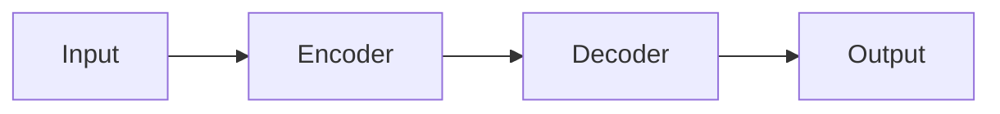

# md2journal

<p align="center">
  <strong>Markdown → Chinese Academic Journal PDF Converter</strong>
</p>

<p align="center">
  <a href="https://www.npmjs.com/package/md2journal">
    
  </a>
  <a href="https://github.com/one1d/md2journal/actions">
    
  </a>
  <a href="./LICENSE">
    
  </a>
</p>

## Overview

md2journal is a Node.js CLI tool that converts Markdown files (with LaTeX formulas and Mermaid diagrams) into PDF documents formatted for Chinese academic journals. It supports three operation modes: single file conversion, batch build, and watch mode for auto-conversion. The output includes three built-in styles: academic journal, Cornell notes, and standard A4.

## Features

- 📝 **Full Markdown Support** — GFM syntax, code highlighting, tables, task lists
- 🔬 **LaTeX Formulas** — KaTeX-powered, inline `$...$` and display `$$...$$` syntax
- 📊 **Mermaid Diagrams** — Flowcharts, state diagrams, sequence diagrams, embedded in Markdown
- 📰 **Chinese Journal Layout** — Serif body, sans-serif headings, three-line tables, first-line indent
- 🌐 **Offline-First** — Automatically inlines local resources, works without internet
- 🎨 **Multi-Style Output** — Generate multiple PDF styles in one conversion
- 👁️ **GUI Mode** — Browser-based visual interface

## Quick Start

```bash
# Install
npm install

# Single file conversion
node cli.js file input.md output.pdf

# Batch conversion
node cli.js build ./input ./output

# Watch mode (auto-convert on file change)
node cli.js watch ./input ./output
```

## Usage Example

```markdown
---
title: Deep Learning Applications in Natural Language Processing
author: Guoqin Chen
date: February 2026
abstract: This paper surveys recent advances in deep learning for NLP...
keywords: [Deep Learning, NLP, Transformer]
---

# Introduction

The Transformer architecture has achieved breakthrough results in NLP.

## Formula Example

Core attention computation:
$$\text{Attention}(Q, K, V) = \text{softmax}\left(\frac{QK^T}{\sqrt{d_k}}\right)V$$

## Diagram Example


```

## Output Styles

| Style | Description |
|-------|-------------|
| `journal` | Chinese academic journal layout (default) |
| `cornell-notes` | Cornell notes format with cue column |
| `normal-a4` | Standard A4 general document |

## Tech Stack

- [marked](https://github.com/markedjs/marked) — Markdown parsing
- [KaTeX](https://github.com/KaTeX/KaTeX) — LaTeX rendering
- [Mermaid](https://github.com/mermaid-js/mermaid) — Diagram generation
- [Puppeteer](https://github.com/puppeteer/puppeteer) — PDF rendering

## License

[Apache License 2.0](./LICENSE)
