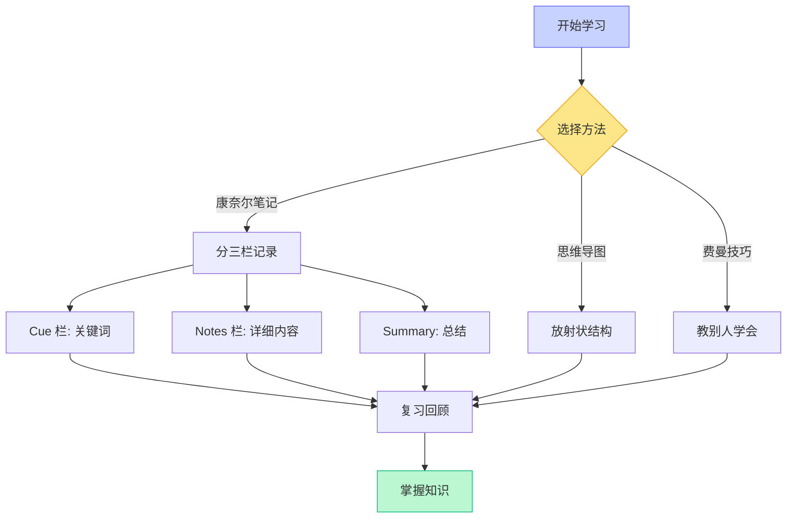
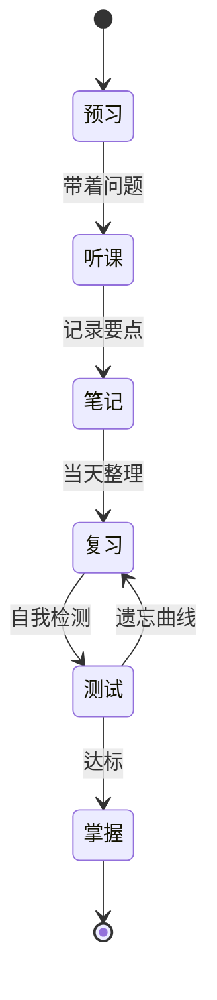
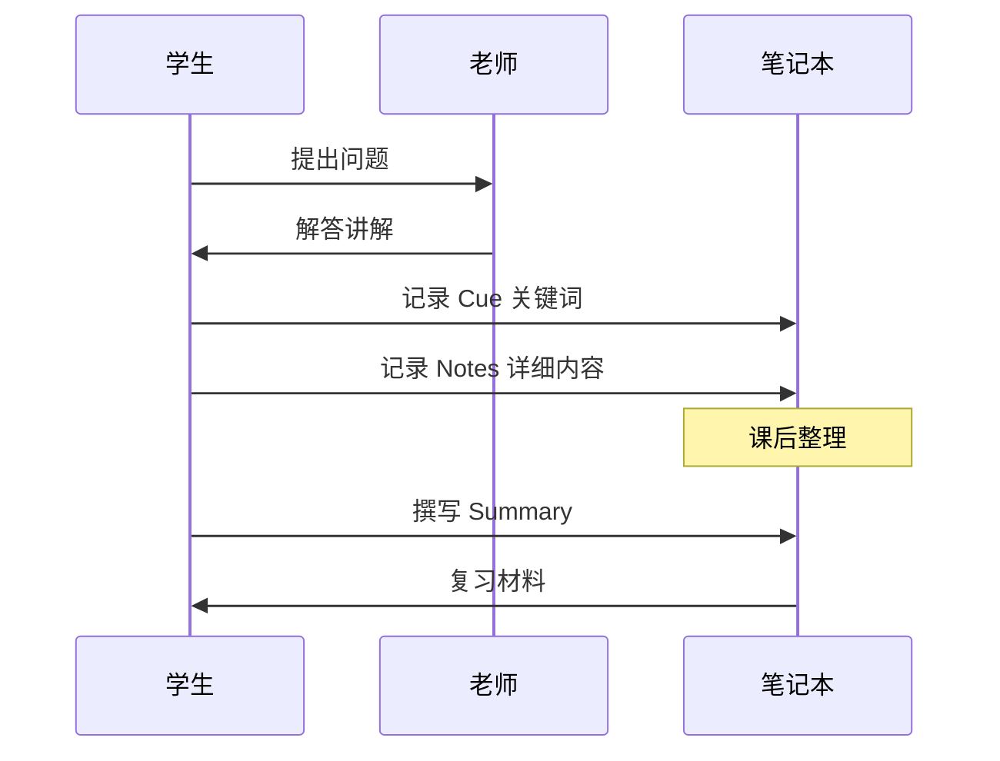
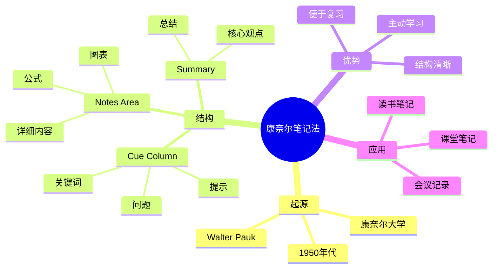

# 数学符号完整测试

## 拉丁字母 (Latin Letters)

数学中的拉丁字母通常使用**斜体**表示变量：

行内公式：设 $x, y, z$ 为实数，$f(x) = ax^2 + bx + c$

行间公式：
$$F(x) = \int_a^b f(t) \, dt$$

$$\sum_{i=1}^{n} x_i = x_1 + x_2 + \cdots + x_n$$

---

## 希腊字母 (Greek Letters)

### 小写希腊字母

常用小写希腊字母表：

|    字母    |   LaTeX    |  名称   |  常见用途  |
| :--------: | :--------: | :-----: | :--------: |
|  $\alpha$  |  `\alpha`  |  alpha  | 角度、系数 |
|  $\beta$   |  `\beta`   |  beta   | 角度、参数 |
|  $\gamma$  |  `\gamma`  |  gamma  |  伽马函数  |
|  $\delta$  |  `\delta`  |  delta  |   变化量   |
| $\epsilon$ | `\epsilon` | epsilon |   极小量   |
|  $\zeta$   |  `\zeta`   |  zeta   |  黎曼函数  |
|   $\eta$   |   `\eta`   |   eta   |    效率    |
|  $\theta$  |  `\theta`  |  theta  |    角度    |
| $\lambda$  | `\lambda`  | lambda  |   特征值   |
|   $\mu$    |   `\mu`    |   mu    |    均值    |
|  $\sigma$  |  `\sigma`  |  sigma  |   标准差   |
|   $\phi$   |   `\phi$   |   phi   |  黄金比例  |
|  $\omega$  |  `\omega`  |  omega  |   角频率   |

行内测试：设角度 $\theta = \frac{\pi}{4}$，则 $\sin\theta = \frac{\sqrt{2}}{2}$

行间公式测试：
$$\Gamma(z) = \int_0^\infty t^{z-1} e^{-t} \, dt$$

$$\zeta(s) = \sum_{n=1}^\infty \frac{1}{n^s}$$

### 大写希腊字母

$$\Sigma = \sum, \quad \Pi = \prod, \quad \Delta = \text{差分}, \quad \Omega = \text{欧姆}$$

$$\Phi(x) = \frac{1}{\sqrt{2\pi}} \int_{-\infty}^{x} e^{-t^2/2} \, dt$$

---

## 希伯来字母 (Hebrew Letters)

集合论中常用的希伯来字母：

|   符号    |   LaTeX   |  名称  |   含义   |
| :-------: | :-------: | :----: | :------: |
| $\aleph$  | `\aleph`  | aleph  | 无穷基数 |
|  $\beth$  |  `\beth`  |  beth  |  贝特数  |
| $\gimel$  | `\gimel`  | gimel  | 吉梅尔数 |
| $\daleth$ | `\daleth` | daleth | 达莱特数 |

**康托尔定理**：自然数集的基数为 $\aleph_0$（阿列夫零）

$$|\mathbb{N}| = \aleph_0, \quad |\mathbb{R}| = 2^{\aleph_0} = \beth_1$$

连续统假设：$\aleph_1 = 2^{\aleph_0}$（独立于 ZFC 公理系统）

---

## 黑板粗体与集合符号 (Blackboard Bold)

常用数集：

$$\mathbb{N} \subset \mathbb{Z} \subset \mathbb{Q} \subset \mathbb{R} \subset \mathbb{C}$$

- $\mathbb{N}$ - 自然数
- $\mathbb{Z}$ - 整数
- $\mathbb{Q}$ - 有理数
- $\mathbb{R}$ - 实数
- $\mathbb{C}$ - 复数

期望与概率：
$$\mathbb{E}[X] = \sum_i x_i P(X = x_i)$$

$$\mathbb{P}(A \cap B) = \mathbb{P}(A) \cdot \mathbb{P}(B|A)$$

---

## 花体与哥特体 (Calligraphic & Fraktur)

### 花体字母 (Calligraphic)

用于表示集合族、拓扑空间等：

$$\mathcal{F} = \{A_1, A_2, \ldots\}, \quad \mathcal{L}(\mathcal{H}) = \text{算子空间}$$

拉格朗日量：$\mathcal{L} = T - V$

### 哥特体 (Fraktur)

用于表示李代数、理想等：

$$\mathfrak{g} = \text{李代数}, \quad \mathfrak{sl}(n) = \text{特殊线性李代数}$$

理想：$\mathfrak{p} \subset \mathfrak{m} \subset R$（素理想、极大理想）

---

## 复杂公式示例

### 麦克斯韦方程组

$$\nabla \cdot \mathbf{E} = \frac{\rho}{\varepsilon_0}$$

$$\nabla \cdot \mathbf{B} = 0$$

$$\nabla \times \mathbf{E} = -\frac{\partial \mathbf{B}}{\partial t}$$

$$\nabla \times \mathbf{B} = \mu_0 \mathbf{J} + \mu_0 \varepsilon_0 \frac{\partial \mathbf{E}}{\partial t}$$

### 薛定谔方程

$$i\hbar \frac{\partial}{\partial t} \Psi(\mathbf{r}, t) = \hat{H} \Psi(\mathbf{r}, t)$$

其中哈密顿算符：
$$\hat{H} = -\frac{\hbar^2}{2m} \nabla^2 + V(\mathbf{r})$$

### 欧拉恒等式

最美的数学公式：

$$e^{i\pi} + 1 = 0$$

它将五个最重要的常数 $e, i, \pi, 1, 0$ 联系在一起。

---

# Mermaid 图表示例

## 流程图



## 状态图



## 序列图



## 思维导图



---

# 代码示例

## Python 数值计算

```python
import numpy as np
from scipy import integrate

def riemann_zeta(s, terms=1000):
    """黎曼 Zeta 函数近似计算"""
    return sum(1/n**s for n in range(1, terms+1))

def gamma_function(z):
    """Gamma 函数 (使用 scipy)"""
    return integrate.quad(
        lambda t: t**(z-1) * np.exp(-t),
        0, np.inf
    )[0]

# 验证 ζ(2) = π²/6
zeta_2 = riemann_zeta(2, 10000)
expected = np.pi**2 / 6
print(f"ζ(2) ≈ {zeta_2:.6f}")
print(f"π²/6 = {expected:.6f}")
print(f"误差: {abs(zeta_2 - expected):.2e}")

# 验证 Γ(1/2) = √π
gamma_half = gamma_function(0.5)
print(f"\nΓ(1/2) ≈ {gamma_half:.6f}")
print(f"√π = {np.sqrt(np.pi):.6f}")
```

## JavaScript 动画

```javascript
class MathAnimation {
  constructor(canvas) {
    this.ctx = canvas.getContext('2d');
    this.width = canvas.width;
    this.height = canvas.height;
  }

  // 绘制正弦波
  drawSineWave(amplitude, frequency, phase) {
    const { ctx, width, height } = this;
    ctx.beginPath();
    ctx.strokeStyle = '#6366f1';
    ctx.lineWidth = 2;

    for (let x = 0; x < width; x++) {
      const y = height / 2 + amplitude * Math.sin((frequency * x * Math.PI) / 180 + phase);
      x === 0 ? ctx.moveTo(x, y) : ctx.lineTo(x, y);
    }
    ctx.stroke();
  }
}
```

---

# Emoji 与视觉元素

## 学科图标

|  学科  | 图标 | 核心公式                           |
| :----: | :--: | :--------------------------------- |
|  数学  |  🔢  | $e^{i\pi} + 1 = 0$                 |
|  物理  |  ⚛️  | $E = mc^2$                         |
|  化学  |  🧪  | $\text{pH} = -\log[\text{H}^+]$    |
|  生物  |  🧬  | DNA → RNA → 蛋白质                 |
| 计算机 |  💻  | $O(n \log n)$                      |
| 经济学 |  📊  | $\text{GDP} = C + I + G + (X - M)$ |

## 学习状态

- ✅ 已掌握：基础概念
- 🔄 复习中：核心公式
- ⏳ 待学习：高级应用
- ❌ 需重学：易错点

## 重要程度

> **重要**: 这是一个需要特别注意的概念！

> **提示**: 记住这个技巧可以提高效率。

> **警告**: 小心这个常见错误！

---

# 总结

## 本节要点回顾

1. **数学字体**：正确使用拉丁、希腊、希伯来字母
2. **公式排版**：行内 `$...$` vs 行间 `$$...$$`
3. **特殊符号**：$\aleph, \mathbb{R}, \mathcal{L}, \mathfrak{g}$
4. **图表工具**：Mermaid 流程图、状态图、思维导图

## 学习建议

- [ ] 每天复习 Cue 栏关键词
- [ ] 用自己的话重述 Summary
- [ ] 尝试解释给他人听（费曼技巧）
- [ ] 定期整理和更新笔记

---

**参考文献**

[1] Pauk W. _How to Study in College_. Cengage Learning, 2013.
[2] Knuth D. _The TeXbook_. Addison-Wesley, 1984.
[3] Lamport L. _LaTeX: A Document Preparation System_. Addison-Wesley, 1994.
