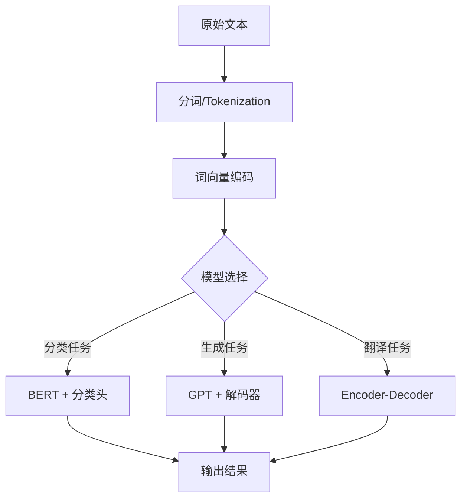
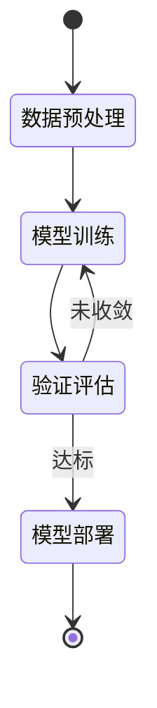

# 引言

自然语言处理（Natural Language Processing, NLP）是人工智能领域的核心研究方向之一。近年来，随着深度学习技术的快速发展，基于神经网络的方法在多项 NLP 任务上取得了突破性进展。

本文旨在梳理深度学习在 NLP 领域的关键技术和最新成果，为后续研究提供参考。

# 技术背景

## 词向量表示

词向量（Word Embedding）是将离散词汇映射到连续向量空间的技术。给定词汇表 $V$，词向量模型学习映射函数：

$$f: V \rightarrow \mathbb{R}^d$$

其中 $d$ 为向量维度。经典的 Word2Vec 模型通过最大化如下目标函数进行训练：

$$J(\theta) = \frac{1}{T} \sum_{t=1}^{T} \sum_{-c \leq j \leq c, j \neq 0} \log p(w_{t+j} | w_t)$$

其中 $T$ 为语料长度，$c$ 为上下文窗口大小。

## Transformer 架构

Transformer 的核心是自注意力机制（Self-Attention），其计算公式为：

$$\text{Attention}(Q, K, V) = \text{softmax}\left(\frac{QK^T}{\sqrt{d_k}}\right)V$$

多头注意力机制在此基础上并行执行 $h$ 组注意力运算：

$$\text{MultiHead}(Q, K, V) = \text{Concat}(\text{head}_1, \dots, \text{head}_h) W^O$$

# 模型对比

下表列出了主流预训练模型的参数规模与性能对比：

|    模型    | 参数量 | 预训练数据 | GLUE 得分 |
| :--------: | :----: | :--------: | :-------: |
| BERT-base  |  110M  |    16GB    |   80.5    |
| BERT-large |  340M  |    16GB    |   82.1    |
|   GPT-2    |  1.5B  |    40GB    |     —     |
|   GPT-3    |  175B  |   570GB    |     —     |

# 系统架构

以下是典型 NLP 系统的处理流程：

以下是模型训练的状态流转：

# 实验结果

实验在标准数据集上进行评估。设模型预测结果为 $\hat{y}$，真实标签为 $y$，则交叉熵损失为：

$$\mathcal{L} = -\sum_{i=1}^{N} \left[ y_i \log \hat{y}_i + (1 - y_i) \log(1 - \hat{y}_i) \right]$$

> **注：** 所有实验均在 NVIDIA A100 GPU 上完成，使用 PyTorch 2.0 框架，训练时间约 48 小时。

### 主要发现

实验表明：

1. 基于 Transformer 的预训练模型在所有下游任务上均优于传统方法
2. 模型规模与任务性能呈现对数线性关系，即 $\text{Performance} \propto \log(N)$
3. 充分的数据增强可以有效缓解小样本场景下的过拟合问题

# 结论

本文系统回顾了深度学习在自然语言处理中的应用进展。Transformer 架构及其衍生模型已成为 NLP 领域的主导范式。未来的研究方向包括：更高效的模型压缩技术、跨语言迁移学习以及多模态融合。

---

**参考文献**

[1] Vaswani A, et al. Attention is all you need. _NeurIPS_, 2017.
[2] Devlin J, et al. BERT: Pre-training of deep bidirectional transformers. _NAACL_, 2019.
[3] Brown T, et al. Language models are few-shot learners. _NeurIPS_, 2020.
