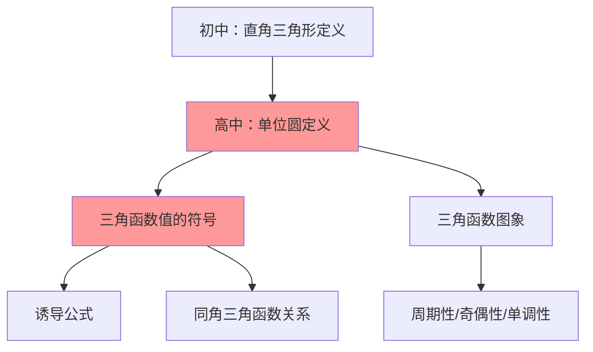

# 三角函数的定义

---

## 一、一句话大白话速懂

**三角函数就是用角度（或弧度）作为"输入"，输出一个数值的"函数机器"——这个数值描述的是单位圆上某点的坐标特征。**

---

## 二、生活化场景类比

### 类比1：旋转木马上的坐标追踪

想象你坐在一个半径为1米的旋转木马（单位圆）上：

- 你从最右边的点(1,0)开始
- 木马逆时针旋转，你转过的角度就是 $\alpha$
- 你的**水平位置**（左右）就是 $\cos\alpha$
- 你的**垂直位置**（上下）就是 $\sin\alpha$

| 位置 |  角度  |   坐标    |         三角函数值          |
| :--: | :----: | :-------: | :-------------------------: |
| 最右 |  $0°$  | $(1, 0)$  |   $\cos 0°=1, \sin 0°=0$    |
| 最上 | $90°$  | $(0, 1)$  |  $\cos 90°=0, \sin 90°=1$   |
| 最左 | $180°$ | $(-1, 0)$ | $\cos 180°=-1, \sin 180°=0$ |
| 最下 | $270°$ | $(0, -1)$ | $\cos 270°=0, \sin 270°=-1$ |

### 类比2：直角三角形的"边长比例"

在直角三角形中，三角函数就是**边与边的比例关系**：

- 对边 ÷ 斜边 = 正弦（sin）
- 邻边 ÷ 斜边 = 余弦（cos）
- 对边 ÷ 邻边 = 正切（tan）

---

## 三、上帝视角本源解析

### 1. 本源：为什么要发明三角函数？

**古代天文学的需求**：古人观测天体运动，发现行星位置与角度密切相关。需要一种工具，能把**角度**转换成**位置坐标**。

**航海与测量的需求**：船员需要知道方向、距离，这些都可以通过角度计算得出。

### 2. 本质：三角函数到底是什么？

**本质是一种"角度→数值"的映射规则**。

就像：

- 温度计把温度映射成数字
- 体重秤把重量映射成数字
- 三角函数把角度映射成坐标比例

### 3. 边界：什么时候能用，什么时候不能用？

|      适用场景      |     不适用场景     |
| :----------------: | :----------------: |
| 已知角度求边长比例 |     角度为复数     |
| 已知边长比例求角度 | 三角形不是平面图形 |
|   周期性运动描述   |  需要精确到无穷小  |

### 4. 体系定位

```
初中：直角三角形中的三角函数（锐角）
    ↓
高中：单位圆定义（任意角）← 你现在在这里
    ↓
后续：三角恒等变换、解三角形、三角函数图象
```

---

## 四、知识点精准拆解

### 4.1 单位圆定义（核心！）

**大白话**：在单位圆（半径为1的圆）上，角度 $\alpha$ 对应的点的坐标就是三角函数值。

**正式定义**：

设角 $\alpha$ 的顶点在坐标原点，始边与 $x$ 轴正半轴重合，终边与单位圆交于点 $P(x, y)$，则：

$$
\sin\alpha = y \quad \text{（纵坐标）}
$$

$$
\cos\alpha = x \quad \text{（横坐标）}
$$

$$
\tan\alpha = \frac{y}{x} = \frac{\sin\alpha}{\cos\alpha} \quad (x \neq 0)
$$

**符号拆解**：

- $\sin\alpha$：sine，"正弦"，记忆：s像蛇，蛇竖着爬→纵坐标
- $\cos\alpha$：cosine，"余弦"，记忆：c像杯子，杯子横放→横坐标
- $\tan\alpha$：tangent，"正切"，记忆：切线斜率

### 4.2 直角坐标定义（一般化）

如果终边上任意一点 $P(x, y)$ 到原点的距离为 $r = \sqrt{x^2 + y^2}$，则：

$$
\sin\alpha = \frac{y}{r} \quad \cos\alpha = \frac{x}{r} \quad \tan\alpha = \frac{y}{x}
$$

**为什么除以r？** 因为单位圆中 $r=1$，所以 $y/r = y$，$x/r = x$。这是把任意点"归一化"到单位圆上。

### 4.3 三角函数值的符号规律

**口诀："一全正，二正弦，三正切，四余弦"**

|   象限   |        角度范围        | sin | cos | tan |
| :------: | :--------------------: | :-: | :-: | :-: |
| 第一象限 |  $0° < \alpha < 90°$   | $+$ | $+$ | $+$ |
| 第二象限 | $90° < \alpha < 180°$  | $+$ | $-$ | $-$ |
| 第三象限 | $180° < \alpha < 270°$ | $-$ | $-$ | $+$ |
| 第四象限 | $270° < \alpha < 360°$ | $-$ | $+$ | $-$ |

**记忆技巧**：

- **一全正**：第一象限，所有三角函数都是正的（像新生儿，纯洁无瑕）
- **二正弦**：第二象限，只有正弦为正（像悲伤，眼泪sin*sin*sin）
- **三正切**：第三象限，只有正切为正（像tan克，负负得正）
- **四余弦**：第四象限，只有余弦为正（像cosplay，假装正面）

**坐标视角理解**：

- 第一象限：$x>0, y>0$ → 全正
- 第二象限：$x<0, y>0$ → sin（y）正，cos（x）负
- 第三象限：$x<0, y<0$ → sin负，cos负，tan（y/x）正
- 第四象限：$x>0, y<0$ → sin负，cos正，tan负

---

## 五、全体系逻辑关系



**知识关联**：

1. 单位圆定义 → 理解任意角的三角函数
2. 符号规律 → 诱导公式的基础
3. 坐标定义 → 解三角形的重要工具

---

## 六、零基础入门例题

### 例题1：求特殊角的三角函数值

**题目**：求 $\sin 120°$、$\cos 120°$、$\tan 120°$ 的值。

**解析**：

**Step 1：确定象限**

- $120°$ 在 $90°$ 到 $180°$ 之间 → **第二象限**
- 第二象限：sin为正，cos为负，tan为负

**Step 2：找参考角**

- 参考角 = $180° - 120° = 60°$
- 参考角就是终边与x轴的夹角

**Step 3：利用特殊角值**

- $\sin 60° = \frac{\sqrt{3}}{2}$
- $\cos 60° = \frac{1}{2}$

**Step 4：加上符号**

- $\sin 120° = +\sin 60° = \frac{\sqrt{3}}{2}$ ✓
- $\cos 120° = -\cos 60° = -\frac{1}{2}$ ✓
- $\tan 120° = -\tan 60° = -\sqrt{3}$ ✓

---

### 例题2：已知终边上一点求三角函数值

**题目**：已知角 $\alpha$ 的终边经过点 $P(-3, 4)$，求 $\sin\alpha$、$\cos\alpha$、$\tan\alpha$。

**解析**：

**Step 1：确定坐标**

- $x = -3$，$y = 4$

**Step 2：计算r（到原点距离）**

$$
r = \sqrt{x^2 + y^2} = \sqrt{(-3)^2 + 4^2} = \sqrt{9 + 16} = \sqrt{25} = 5
$$

**Step 3：套公式**

$$
\sin\alpha = \frac{y}{r} = \frac{4}{5}
$$

$$
\cos\alpha = \frac{x}{r} = \frac{-3}{5} = -\frac{3}{5}
$$

$$
\tan\alpha = \frac{y}{x} = \frac{4}{-3} = -\frac{4}{3}
$$

**验证**：$x<0, y>0$ → 第二象限 → sin正，cos负，tan负 ✓

---

### 例题3：判断三角函数值的符号

**题目**：判断下列各式的符号：
(1) $\sin 200° \cdot \cos 300°$
(2) $\tan 150° \cdot \sin 250°$

**解析**：

**(1)**

- $200°$ 在第三象限 → $\sin 200° < 0$
- $300°$ 在第四象限 → $\cos 300° > 0$
- 结果：负 × 正 = **负**

**(2)**

- $150°$ 在第二象限 → $\tan 150° < 0$
- $250°$ 在第三象限 → $\sin 250° < 0$
- 结果：负 × 负 = **正**

---

## 七、文科生高频易错雷区

### 雷区1：混淆角度制与弧度制

**错误**：$\sin 1°$ 和 $\sin 1$（弧度）混为一谈

**正确理解**：

- $1° ≈ 0.017$ 弧度（很小）
- $1$ 弧度 $≈ 57.3°$（接近$60°$）
- $\sin 1° ≈ 0.017$，$\sin 1 ≈ 0.84$

**避坑**：看到没有°符号的角度，默认是弧度！

### 雷区2：忘记tan的定义域限制

**错误**：直接写 $\tan 90° = \frac{\sin 90°}{\cos 90°} = \frac{1}{0} = \infty$

**正确理解**：

- $\tan\alpha = \frac{y}{x}$，当 $x = 0$ 时（即 $\alpha = 90° + k·180°$），**tan不存在**
- 不能说等于无穷大，应该说"无定义"

### 雷区3：符号判断错误

**典型错误**：$\cos 200° = \cos 20°$（忘记加负号）

**正确做法**：

- 先判断象限 → 第三象限 → cos为负
- 再算参考角 → $200° - 180° = 20°$
- 最后加符号 → $\cos 200° = -\cos 20°$

### 雷区4：r的计算错误

**错误**：$r = x + y$（把距离当成坐标和）

**正确**：$r = \sqrt{x^2 + y^2}$（勾股定理）

---

## 八、高考考点提示

### 考查频率：⭐⭐⭐⭐（高频基础）

### 常见考法：

|            题型            | 分值  | 难度 |
| :------------------------: | :---: | :--: |
|    求特殊角的三角函数值    | 4-5分 |  ⭐  |
| 已知终边上一点求三角函数值 | 4-5分 | ⭐⭐ |
|    判断三角函数值的符号    | 4-5分 |  ⭐  |

### 高考真题示例（改编）：

**题目**（2022全国卷）：已知角 $\alpha$ 的终边经过点 $(-4, 3)$，则 $\cos\alpha =$（ ）

A. $\frac{4}{5}$ B. $-\frac{4}{5}$ C. $\frac{3}{5}$ D. $-\frac{3}{5}$

**答案**：B

**解析**：$r = \sqrt{(-4)^2 + 3^2} = 5$，$\cos\alpha = \frac{x}{r} = \frac{-4}{5} = -\frac{4}{5}$

### 备考建议：

1. 熟记特殊角的三角函数值（$0°, 30°, 45°, 60°, 90°$）
2. 掌握符号判断的"口诀法"和"坐标法"
3. 注意tan的定义域限制

---

> 📌 **学习总结**：三角函数的定义是整个三角学的基础。记住"单位圆上的坐标"这个核心概念，所有问题都能迎刃而解。
