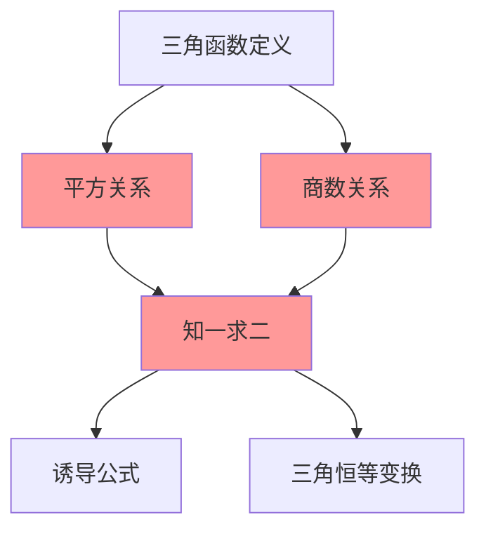

# 平方关系与商数关系

---

## 一、一句话大白话速懂

**sin和cos是"亲兄弟"，它们的平方和永远等于1；tan是它们的"商"，等于sin除以cos。**

---

## 二、生活化场景类比

### 类比1：直角三角形的"勾股定理"

想象一个直角三角形，斜边长度为1：
- 两条直角边分别是 $\sin\alpha$ 和 $\cos\alpha$
- 根据勾股定理：$(\sin\alpha)^2 + (\cos\alpha)^2 = 1^2 = 1$

这就是平方关系的几何本质！

### 类比2：家庭成员的比例关系

- **sin和cos**：像一对夫妻，关系紧密（平方和为1）
- **tan**：像他们的孩子，是两人的"商"（sin÷cos）

### 类比3：坐标与斜率

在单位圆上：
- 点P的坐标是 $(\cos\alpha, \sin\alpha)$
- OP连线的斜率 = $\frac{\sin\alpha}{\cos\alpha} = \tan\alpha$

---

## 三、上帝视角本源解析

### 1. 本源：为什么要研究这些关系？

**简化计算的需求**：
- 已知 $\sin\alpha$，想求 $\cos\alpha$ 怎么办？
- 已知 $\sin\alpha$ 和 $\cos\alpha$，想快速求 $\tan\alpha$ 怎么办？

这些关系式提供了一条"捷径"，不用每次都画图或查表。

### 2. 本质：这些公式到底在说什么？

**本质是同角三角函数之间的"内在约束"**。

就像：
- 一个人的身高和体重有一定关系（虽然不是严格的数学关系）
- sin、cos、tan之间也有严格的数学约束

**核心洞察**：知道其中一个，就能求出其他（在一定条件下）。

### 3. 边界：什么时候能用，什么时候不能用？

| 适用场景 | 不适用场景 |
|:---:|:---:|
| 同一个角的三角函数转换 | 不同角之间（如sinα和cosβ） |
| 已知一个求另一个 | 需要确定符号时忘记判断象限 |
| 化简三角函数式 | tanα中cosα=0时 |

### 4. 体系定位

```
三角函数的定义
    ↓
同角三角函数关系 ← 你现在在这里
    ↓
诱导公式 → 三角恒等变换
    ↓
解三角形
```

---

## 四、知识点精准拆解

### 4.1 平方关系

**公式**：
$$
\sin^2\alpha + \cos^2\alpha = 1
$$

**符号说明**：
- $\sin^2\alpha$ 表示 $(\sin\alpha)^2$，即 $\sin\alpha$ 的平方
- 注意：不是 $\sin(\alpha^2)$！

**推导过程**（单位圆法）：

设角 $\alpha$ 的终边与单位圆交于点 $P(x, y)$
- 由定义：$x = \cos\alpha$，$y = \sin\alpha$
- 点P在单位圆上，满足：$x^2 + y^2 = 1$
- 代入得：$\cos^2\alpha + \sin^2\alpha = 1$ ✓

**变形公式**（必须掌握！）：
$$
\sin^2\alpha = 1 - \cos^2\alpha
$$
$$
\cos^2\alpha = 1 - \sin^2\alpha
$$
$$
\sin\alpha = \pm\sqrt{1 - \cos^2\alpha}
$$
$$
\cos\alpha = \pm\sqrt{1 - \sin^2\alpha}
$$

**⚠️ 注意**：开方时必须先判断符号！

### 4.2 商数关系

**公式**：
$$
\tan\alpha = \frac{\sin\alpha}{\cos\alpha} \quad (\cos\alpha \neq 0)
$$

**推导过程**（坐标法）：

设角 $\alpha$ 终边上一点 $P(x, y)$，到原点距离为 $r$
- $\sin\alpha = \frac{y}{r}$，$\cos\alpha = \frac{x}{r}$
- $\frac{\sin\alpha}{\cos\alpha} = \frac{y/r}{x/r} = \frac{y}{x} = \tan\alpha$ ✓

**变形公式**：
$$
\sin\alpha = \tan\alpha \cdot \cos\alpha
$$
$$
\cos\alpha = \frac{\sin\alpha}{\tan\alpha}
$$

### 4.3 两个关系式的联系

由平方关系和商数关系，可以推出：
$$
1 + \tan^2\alpha = \frac{1}{\cos^2\alpha} = \sec^2\alpha
$$

（虽然sec在高考中不常用，但了解这个关系有助于理解体系）

---

## 五、全体系逻辑关系



**核心功能**：
- **知一求二**：已知 $\sin\alpha$、$\cos\alpha$、$\tan\alpha$ 中的一个，可以求出另外两个
- **化简工具**：将复杂的三角函数式化简

---

## 六、零基础入门例题

### 例题1：已知sin求cos

**题目**：已知 $\sin\alpha = \frac{3}{5}$，且 $\alpha$ 是第二象限角，求 $\cos\alpha$ 和 $\tan\alpha$。

**解析**：

**Step 1：用平方关系求cos**
$$
\cos^2\alpha = 1 - \sin^2\alpha = 1 - \left(\frac{3}{5}\right)^2 = 1 - \frac{9}{25} = \frac{16}{25}
$$
$$
\cos\alpha = \pm\frac{4}{5}
$$

**Step 2：判断符号**
- $\alpha$ 在第二象限
- 第二象限：cos < 0
- 所以 $\cos\alpha = -\frac{4}{5}$

**Step 3：用商数关系求tan**
$$
\tan\alpha = \frac{\sin\alpha}{\cos\alpha} = \frac{3/5}{-4/5} = \frac{3}{5} \times \left(-\frac{5}{4}\right) = -\frac{3}{4}
$$

**验证**：第二象限，tan < 0 ✓

---

### 例题2：已知tan求sin和cos

**题目**：已知 $\tan\alpha = 2$，且 $\alpha$ 是第三象限角，求 $\sin\alpha$ 和 $\cos\alpha$。

**解析**：

**Step 1：建立关系**
由 $\tan\alpha = \frac{\sin\alpha}{\cos\alpha} = 2$，得 $\sin\alpha = 2\cos\alpha$

**Step 2：代入平方关系**
$$
\sin^2\alpha + \cos^2\alpha = 1
$$
$$
(2\cos\alpha)^2 + \cos^2\alpha = 1
$$
$$
4\cos^2\alpha + \cos^2\alpha = 1
$$
$$
5\cos^2\alpha = 1
$$
$$
\cos^2\alpha = \frac{1}{5}
$$
$$
\cos\alpha = \pm\frac{\sqrt{5}}{5}
$$

**Step 3：判断符号**
- $\alpha$ 在第三象限
- 第三象限：sin < 0，cos < 0
- 所以 $\cos\alpha = -\frac{\sqrt{5}}{5}$

**Step 4：求sin**
$$
\sin\alpha = 2\cos\alpha = 2 \times \left(-\frac{\sqrt{5}}{5}\right) = -\frac{2\sqrt{5}}{5}
$$

---

### 例题3：齐次式的化简

**题目**：已知 $\tan\alpha = 3$，求 $\frac{\sin\alpha + 2\cos\alpha}{2\sin\alpha - \cos\alpha}$ 的值。

**解析**：

**技巧：分子分母同除以cosα**

$$
\frac{\sin\alpha + 2\cos\alpha}{2\sin\alpha - \cos\alpha} = \frac{\frac{\sin\alpha}{\cos\alpha} + 2\frac{\cos\alpha}{\cos\alpha}}{2\frac{\sin\alpha}{\cos\alpha} - \frac{\cos\alpha}{\cos\alpha}} = \frac{\tan\alpha + 2}{2\tan\alpha - 1}
$$

**代入计算**：
$$
= \frac{3 + 2}{2 \times 3 - 1} = \frac{5}{5} = 1
$$

**关键识别**：分子分母中sin和cos的次数相同（都是1次），称为"齐次式"，可以用这种技巧。

---

### 例题4：平方关系的直接应用

**题目**：化简 $\sqrt{1 - \sin^2 30°}$。

**解析**：

$$
\sqrt{1 - \sin^2 30°} = \sqrt{\cos^2 30°} = |\cos 30°| = \cos 30° = \frac{\sqrt{3}}{2}
$$

**注意**：开方要加绝对值！虽然这里结果是正的，但概念上要清楚。

---

## 七、文科生高频易错雷区

### 雷区1：开方忘记判断符号

**错误**：已知 $\sin\alpha = \frac{1}{2}$，直接写 $\cos\alpha = \sqrt{1 - \frac{1}{4}} = \frac{\sqrt{3}}{2}$

**正确做法**：
- 必须先确定 $\alpha$ 所在象限
- 如果 $\alpha$ 在第一象限，$\cos\alpha = \frac{\sqrt{3}}{2}$
- 如果 $\alpha$ 在第二象限，$\cos\alpha = -\frac{\sqrt{3}}{2}$

**口诀**：开方必加±，符号看象限

### 雷区2：混淆sin²α和sinα²

**错误**：认为 $\sin^2\alpha = \sin(\alpha^2)$

**正确理解**：
- $\sin^2\alpha = (\sin\alpha)^2$ ✓
- $\sin\alpha^2 = \sin(\alpha^2)$（先平方再取正弦）

**记忆**：三角函数符号的平方，写在函数名后面

### 雷区3：tan中cos=0的情况

**错误**：认为 $\tan\alpha = \frac{\sin\alpha}{\cos\alpha}$ 对所有α都成立

**正确理解**：
- 当 $\cos\alpha = 0$ 时（即 $\alpha = 90° + k·180°$），tan不存在
- 公式成立的前提是 $\cos\alpha \neq 0$

### 雷区4：齐次式识别错误

**错误**：看到 $\frac{\sin\alpha + \cos^2\alpha}{\sin\alpha - \cos\alpha}$ 也想用同除cos的方法

**正确理解**：
- 分子：sinα是1次，cos²α是2次 → **不是齐次式**
- 只有分子分母各项次数相同才能用同除法

---

## 八、高考考点提示

### 考查频率：⭐⭐⭐⭐⭐（必考基础）

### 常见考法：

| 题型 | 分值 | 难度 |
|:---:|:---:|:---:|
| 已知一个三角函数值求其他 | 4-5分 | ⭐⭐ |
| 齐次式的化简求值 | 4-5分 | ⭐⭐⭐ |
| 三角函数式的化简 | 4-5分 | ⭐⭐ |

### 高考真题示例（改编）：

**题目**（2021全国卷）：已知 $\tan\alpha = 2$，则 $\frac{\sin\alpha + \cos\alpha}{\sin\alpha - \cos\alpha} =$（ ）

A. 1  B. 2  C. 3  D. 4

**答案**：C

**解析**：分子分母同除以cosα：
$$
\frac{\tan\alpha + 1}{\tan\alpha - 1} = \frac{2 + 1}{2 - 1} = 3
$$

### 备考建议：
1. 熟记两个基本关系式
2. 掌握"知一求二"的方法
3. 学会识别齐次式并掌握化简技巧
4. 开方时一定要先判断符号

---

> 📌 **学习总结**：平方关系和商数关系是三角函数的"基本法则"。记住：sin² + cos² = 1，tan = sin/cos，配合象限判断，就能解决大部分基础问题。
