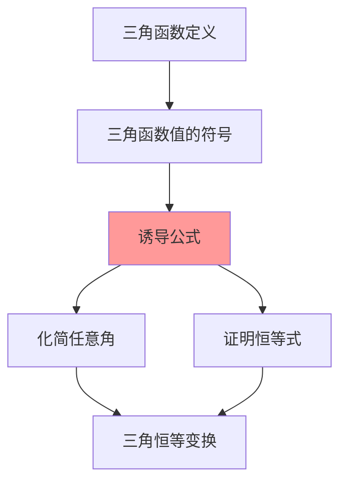

# 诱导公式的记忆口诀

---

## 一、一句话大白话速懂

**诱导公式就是把"复杂角"（如180°+α、-α）的三角函数，转化成"简单角"（α）的三角函数的一套规则。**

---

## 二、生活化场景类比

### 类比1：镜子里的自己

- **-α（负角）**：像照镜子，左右相反
  - sin(-α) = -sinα（上下颠倒）
  - cos(-α) = cosα（左右对称）

### 类比2：掉头转向

- **180°±α**：像掉头180°，前后相反
  - sin(180°+α) = -sinα（y坐标变负）
  - cos(180°+α) = -cosα（x坐标变负）

### 类比3：横平竖直

- **90°±α、270°±α**：像转90°，横竖互换
  - sin变成cos，cos变成sin

---

## 三、上帝视角本源解析

### 1. 本源：为什么要发明诱导公式？

**简化计算的需求**：
- 没有计算器时，需要查表求三角函数值
- 如果表上只有0°到90°的值，怎么求150°的值？
- 诱导公式把任意角转化成锐角，就能查表了！

### 2. 本质：诱导公式到底在做什么？

**本质是"坐标变换"**。

把终边在不同位置的角，通过坐标轴的对称、旋转，转化成第一象限的角。

| 公式类型 | 几何意义 |
|:---:|:---:|
| -α | 关于x轴对称 |
| 180°-α | 关于y轴对称 |
| 180°+α | 关于原点对称 |
| 90°-α | 顺时针转90° |
| 90°+α | 逆时针转90° |

### 3. 边界：什么时候能用？

| 适用场景 | 不适用场景 |
|:---:|:---:|
| 化简任意角的三角函数 | 不同角之间的运算 |
| 求负角、大角的三角函数值 | 需要精确数值时（还需查表或计算） |
| 证明三角恒等式 | 涉及和差倍半的复杂变换 |

### 4. 体系定位

```
三角函数定义
    ↓
同角三角函数关系
    ↓
诱导公式 ← 你现在在这里
    ↓
三角恒等变换（和差倍半公式）
    ↓
解三角形
```

---

## 四、知识点精准拆解

### 4.1 核心口诀："奇变偶不变，符号看象限"

**口诀拆解**：

**第一句：奇变偶不变**
- **"奇偶"**：指 $90°$ 的倍数（即 $\frac{\pi}{2}$ 的倍数）
  - $90°·k$ 中，k是奇数还是偶数
- **"变"**：函数名改变（sin↔cos，tan↔cot）
- **"不变"**：函数名不变

| 形式 | k值 | 奇偶 | 函数名 |
|:---:|:---:|:---:|:---:|
| $90°·1 ± α = 90° ± α$ | 1 | 奇 | 变 |
| $90°·2 ± α = 180° ± α$ | 2 | 偶 | 不变 |
| $90°·3 ± α = 270° ± α$ | 3 | 奇 | 变 |
| $90°·4 ± α = 360° ± α$ | 4 | 偶 | 不变 |

**第二句：符号看象限**
- 把 $\alpha$ 看作**锐角**（0° < α < 90°）
- 判断原角（如180°+α）所在的象限
- 根据该象限中原函数的符号，确定结果的正负

### 4.2 公式分类记忆

#### 类型一：负角公式（k=0，偶）

$$
\sin(-\alpha) = -\sin\alpha
$$
$$
\cos(-\alpha) = \cos\alpha
$$
$$
\tan(-\alpha) = -\tan\alpha
$$

**记忆**：cos是偶函数（关于y轴对称），sin和tan是奇函数（关于原点对称）

#### 类型二：180°±α公式（k=2，偶）

$$
\sin(180° - \alpha) = \sin\alpha
$$
$$
\cos(180° - \alpha) = -\cos\alpha
$$
$$
\sin(180° + \alpha) = -\sin\alpha
$$
$$
\cos(180° + \alpha) = -\cos\alpha
$$

**记忆口诀**："180°，sin不变号，cos都变号"

#### 类型三：360°±α公式（k=4，偶）

$$
\sin(360° - \alpha) = -\sin\alpha
$$
$$
\cos(360° - \alpha) = \cos\alpha
$$
$$
\sin(360° + \alpha) = \sin\alpha
$$
$$
\cos(360° + \alpha) = \cos\alpha
$$

**记忆**：360°是一圈，转回来和原来一样（周期性）

#### 类型四：90°±α公式（k=1，奇）

$$
\sin(90° - \alpha) = \cos\alpha
$$
$$
\cos(90° - \alpha) = \sin\alpha
$$
$$
\sin(90° + \alpha) = \cos\alpha
$$
$$
\cos(90° + \alpha) = -\sin\alpha
$$

**记忆**：90°时横竖互换，sin变cos，cos变sin

#### 类型五：270°±α公式（k=3，奇）

$$
\sin(270° - \alpha) = -\cos\alpha
$$
$$
\cos(270° - \alpha) = -\sin\alpha
$$
$$
\sin(270° + \alpha) = -\cos\alpha
$$
$$
\cos(270° + \alpha) = \sin\alpha
$$

### 4.3 口诀应用步骤

**Step 1**：判断 $90°·k ± \alpha$ 中的k是奇数还是偶数
- k为奇数 → 函数名改变
- k为偶数 → 函数名不变

**Step 2**：把α看作锐角，判断原角所在象限

**Step 3**：根据象限确定原函数的符号

**Step 4**：组合结果

---

## 五、全体系逻辑关系



**核心功能**：
- 把任意角的三角函数转化为锐角的三角函数
- 化简复杂的三角函数表达式

---

## 六、零基础入门例题

### 例题1：口诀应用基础

**题目**：用口诀化简 $\sin(180° + 30°)$

**解析**：

**Step 1：奇变偶不变**
- $180° + 30° = 90°·2 + 30°$
- k = 2（偶数）→ 函数名不变，还是sin

**Step 2：符号看象限**
- 把30°看作锐角
- $180° + 30° = 210°$ 在第三象限
- 第三象限sin为负

**Step 3：结果**
$$
\sin(180° + 30°) = -\sin 30° = -\frac{1}{2}
$$

---

### 例题2：函数名改变的情况

**题目**：化简 $\cos(90° + 45°)$

**解析**：

**Step 1：奇变偶不变**
- $90° + 45° = 90°·1 + 45°$
- k = 1（奇数）→ 函数名改变，cos变sin

**Step 2：符号看象限**
- 把45°看作锐角
- $90° + 45° = 135°$ 在第二象限
- 第二象限cos为负

**Step 3：结果**
$$
\cos(90° + 45°) = -\sin 45° = -\frac{\sqrt{2}}{2}
$$

---

### 例题3：负角的处理

**题目**：化简 $\sin(-60°)$

**解析**：

**方法一：口诀法**
- $-60° = 0° - 60° = 90°·0 - 60°$
- k = 0（偶数）→ 函数名不变
- $-60°$ 在第四象限，sin为负
- 结果：$\sin(-60°) = -\sin 60° = -\frac{\sqrt{3}}{2}$

**方法二：奇函数性质**
- sin是奇函数：$\sin(-\alpha) = -\sin\alpha$
- 结果：$\sin(-60°) = -\sin 60° = -\frac{\sqrt{3}}{2}$

---

### 例题4：综合化简

**题目**：化简 $\frac{\sin(180° + \alpha)·\cos(360° - \alpha)}{\cos(180° - \alpha)·\sin(-\alpha)}$

**解析**：

**Step 1：分别化简各部分**
- $\sin(180° + \alpha) = -\sin\alpha$（180°公式，第三象限sin负）
- $\cos(360° - \alpha) = \cos\alpha$（360°公式，第四象限cos正）
- $\cos(180° - \alpha) = -\cos\alpha$（180°公式，第二象限cos负）
- $\sin(-\alpha) = -\sin\alpha$（负角公式）

**Step 2：代入原式**
$$
\frac{(-\sin\alpha)·(\cos\alpha)}{(-\cos\alpha)·(-\sin\alpha)} = \frac{-\sin\alpha·\cos\alpha}{\sin\alpha·\cos\alpha} = -1
$$

---

## 七、文科生高频易错雷区

### 雷区1："符号看象限"时忘记把α看作锐角

**错误**：判断 $\sin(180° + 120°)$ 的符号时，认为120°在第二象限，sin为正

**正确做法**：
- 口诀中的"符号看象限"，是**假设α是锐角**来判断
- $180° + \text{锐角}$ 在第三象限
- 第三象限sin为负
- 结果：$\sin(180° + 120°) = -\sin 120°$

### 雷区2：混淆k的奇偶

**错误**：认为 $270°$ 中k=2（因为270÷90=3，但记成偶数）

**正确**：
- $270° = 90° × 3$
- k = 3（奇数）→ 函数名改变

**记忆技巧**：k = 角度 ÷ 90°，只看这个商是奇数还是偶数

### 雷区3：90°±α的符号判断错误

**错误**：$\sin(90° + \alpha) = \sin\alpha$（忘记变号和变函数名）

**正确**：
- k=1（奇数）→ sin变cos
- $90° + \text{锐角}$ 在第二象限，sin为正
- 结果：$\sin(90° + \alpha) = +\cos\alpha$

### 雷区4：tan的诱导公式记错

**错误**：$\tan(180° - \alpha) = \tan\alpha$

**正确**：
- $\tan(180° - \alpha) = \frac{\sin(180° - \alpha)}{\cos(180° - \alpha)} = \frac{\sin\alpha}{-\cos\alpha} = -\tan\alpha$

**记忆**：tan的符号规律和sin一致（因为tan=sin/cos，cos在第二象限为负）

---

## 八、高考考点提示

### 考查频率：⭐⭐⭐⭐（高频基础）

### 常见考法：

| 题型 | 分值 | 难度 |
|:---:|:---:|:---:|
| 化简求值 | 4-5分 | ⭐⭐ |
| 证明恒等式 | 4-5分 | ⭐⭐⭐ |
| 综合计算 | 4-5分 | ⭐⭐⭐ |

### 高考真题示例（改编）：

**题目**（2020全国卷）：$\sin 240° =$（ ）

A. $\frac{1}{2}$  B. $-\frac{1}{2}$  C. $\frac{\sqrt{3}}{2}$  D. $-\frac{\sqrt{3}}{2}$

**答案**：D

**解析**：
- $240° = 180° + 60°$
- k=2（偶数），函数名不变
- $180° + 60°$ 在第三象限，sin为负
- $\sin 240° = -\sin 60° = -\frac{\sqrt{3}}{2}$

### 备考建议：
1. 熟记"奇变偶不变，符号看象限"口诀
2. 重点掌握180°±α和90°±α的公式
3. 多练习化简题，提高熟练度
4. 注意tan的诱导公式可以通过sin/cos推导

---

> 📌 **学习总结**：诱导公式是三角函数的"化简利器"。记住口诀"奇变偶不变，符号看象限"，配合"把α看作锐角"的原则，就能正确化简任意角的三角函数。
