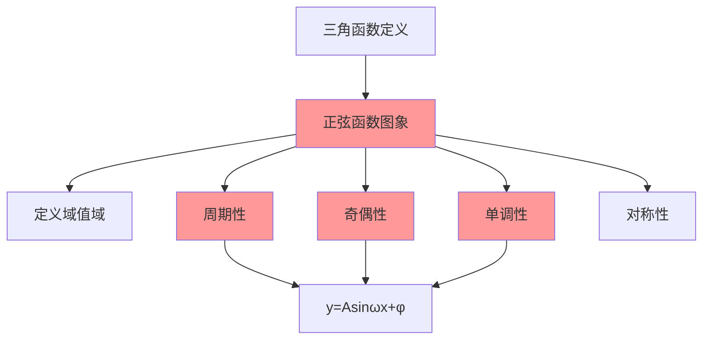

# 正弦函数的图象与性质

---

## 一、一句话大白话速懂

**正弦函数y=sinx是一条"波浪线"，在-1到1之间来回摆动，每2π重复一次，关于原点对称，像一条永不停歇的海浪。**

---

## 二、生活化场景类比

### 类比1：海浪的起伏

站在海边看海浪：
- 海浪有规律的起伏 → 正弦波的周期性
- 最高点和最低点 → 最大值1和最小值-1
- 波浪一个接一个 → 周期2π

### 类比2：秋千的摆动

荡秋千时的运动：
- 从中间到最高，再回来，再到另一边最高 → 一个周期
- 最高点高度相同 → 振幅固定
- 来回摆动 → 周期性运动

### 类比3：心电图

医院的心电图就是正弦波：
- 有规律的心跳 → 周期性
- 波峰波谷 → 最大值最小值
- 频率反映心率 → 周期与频率的关系

---

## 三、上帝视角本源解析

### 1. 本源：为什么要研究正弦函数的图象？

**直观理解的需求**：
- 公式是抽象的，图象是直观的
- 通过图象可以一眼看出函数的所有性质

**实际应用的需求**：
- 声波、光波、电磁波都是正弦波
- 交流电的电压电流是正弦波
- 理解正弦函数 = 理解自然界中的周期现象

### 2. 本质：正弦函数的本质是什么？

**本质是"单位圆上点的纵坐标随角度变化的轨迹"**。

当点在单位圆上匀速转动时，其y坐标随时间变化的规律就是正弦函数。

### 3. 边界：什么时候能用正弦函数描述？

| 适用场景 | 不适用场景 |
|:---:|:---:|
| 周期性往复运动 | 一次性事件 |
| 波动现象 | 随机噪声 |
| 简谐振动 | 阻尼振动（振幅衰减） |

### 4. 体系定位

```
三角函数定义
    ↓
诱导公式、同角关系
    ↓
三角恒等变换
    ↓
正弦函数图象与性质 ← 你现在在这里
    ↓
y=Asin(ωx+φ)的图象变换
    ↓
三角函数综合应用
```

---

## 四、知识点精准拆解

### 4.1 基本图象

**函数**：$y = \sin x$


**五个关键点**（一个周期内）：

| x | 0 | $\frac{\pi}{2}$ | $\pi$ | $\frac{3\pi}{2}$ | $2\pi$ |
|:---:|:---:|:---:|:---:|:---:|:---:|
| y | 0 | 1 | 0 | -1 | 0 |

**图象特征**：
- 起点在原点(0, 0)
- 先上升到最高点$(\frac{\pi}{2}, 1)$
- 再下降到原点$(\pi, 0)$
- 继续下降到最低点$(\frac{3\pi}{2}, -1)$
- 最后回到$(2\pi, 0)$

### 4.2 定义域和值域

**定义域**：$x \in \mathbb{R}$（全体实数）

**值域**：$y \in [-1, 1]$

**最值**：

- 最大值：$y_{max} = 1$，当 $x = \frac{\pi}{2} + 2k\pi$ 时取得
- 最小值：$y_{min} = -1$，当 $x = \frac{3\pi}{2} + 2k\pi$ 时取得

### 4.3 周期性

**周期定义**：函数值重复出现的最小间隔

**正弦函数的周期**：$T = 2\pi$

**验证**：$\sin(x + 2\pi) = \sin x$

**意义**：每转一圈（2π弧度），函数值重复一次

### 4.4 奇偶性

**判断**：$\sin(-x) = -\sin x$

**结论**：正弦函数是**奇函数**

**图象特征**：关于**原点对称**

### 4.5 单调性

**单调递增区间**：
$$
\left[-\frac{\pi}{2} + 2k\pi, \frac{\pi}{2} + 2k\pi\right], \quad k \in \mathbb{Z}
$$

**单调递减区间**：
$$
\left[\frac{\pi}{2} + 2k\pi, \frac{3\pi}{2} + 2k\pi\right], \quad k \in \mathbb{Z}
$$

**记忆技巧**：
- 从波谷到波峰：递增
- 从波峰到波谷：递减

### 4.6 对称性

**对称轴**：$x = \frac{\pi}{2} + k\pi$（过波峰和波谷的垂线）

**对称中心**：$(k\pi, 0)$（与x轴的交点）

---

## 五、全体系逻辑关系



---

## 六、零基础入门例题

### 例题1：求定义域和值域

**题目**：求函数 $y = \sin x$ 的定义域和值域。

**解析**：

**定义域**：
- 正弦函数对所有实数x都有定义
- 定义域为 $\mathbb{R}$

**值域**：
- 单位圆上点的纵坐标范围是[-1, 1]
- 值域为 $[-1, 1]$

---

### 例题2：求周期

**题目**：求函数 $y = \sin x$ 的周期。

**解析**：

由 $\sin(x + 2\pi) = \sin x$，且2π是最小的正周期

**周期**：$T = 2\pi$

---

### 例题3：判断奇偶性

**题目**：判断函数 $y = \sin x$ 的奇偶性。

**解析**：

**Step 1：计算f(-x)**
$$
f(-x) = \sin(-x) = -\sin x = -f(x)
$$

**Step 2：判断**
- 满足 $f(-x) = -f(x)$
- 所以是**奇函数**

**图象验证**：关于原点对称 ✓

---

### 例题4：求单调区间

**题目**：求函数 $y = \sin x$ 在 $[0, 2\pi]$ 上的单调区间。

**解析**：

**单调递增**：$[0, \frac{\pi}{2}]$ 和 $[\frac{3\pi}{2}, 2\pi]$（从波谷到波峰）

**单调递减**：$[\frac{\pi}{2}, \frac{3\pi}{2}]$（从波峰到波谷）

**图示**：


---

### 例题5：求最值

**题目**：求函数 $y = \sin x$ 在 $[0, \pi]$ 上的最大值和最小值。

**解析**：

**分析图象**：


- 在$[0, \pi]$上，sinx先增后减
- 在$x = \frac{\pi}{2}$处取得最大值
- 在端点$x = 0$和$x = \pi$处取得最小值

**结果**：
- 最大值：$y_{max} = \sin\frac{\pi}{2} = 1$
- 最小值：$y_{min} = \sin 0 = \sin\pi = 0$

---

## 七、文科生高频易错雷区

### 雷区1：周期记错

**错误**：认为sinx的周期是π

**正确**：周期是$2\pi$

**记忆**：转一圈才回来

### 雷区2：奇偶性判断错误

**错误**：认为sinx是偶函数

**正确**：sinx是奇函数

**记忆**：
- sin(-x) = -sinx（奇函数）
- cos(-x) = cosx（偶函数）

### 雷区3：单调区间写错

**错误**：sinx在$[0, \pi]$上单调递增

**正确**：sinx在$[0, \frac{\pi}{2}]$递增，在$[\frac{\pi}{2}, \pi]$递减

**记忆**：先上升到波峰，再下降

### 雷区4：最值点找错

**错误**：sinx在x=0时取得最大值

**正确**：sinx在$x = \frac{\pi}{2} + 2k\pi$时取得最大值

**记忆**：波峰在90°（π/2）

---

## 八、高考考点提示

### 考查频率：⭐⭐⭐⭐⭐（必考核心）

### 常见考法：

| 题型 | 分值 | 难度 |
|:---:|:---:|:---:|
| 求定义域、值域 | 4-5分 | ⭐ |
| 求周期 | 4-5分 | ⭐ |
| 判断奇偶性 | 4-5分 | ⭐ |
| 求单调区间 | 4-5分 | ⭐⭐ |
| 求最值 | 4-5分 | ⭐⭐ |

### 高考真题示例（改编）：

**题目**（2022全国卷）：函数 $f(x) = \sin x$ 的最小正周期为____。

**答案**：$2\pi$

**解析**：由正弦函数的周期性，$\sin(x + 2\pi) = \sin x$，所以周期为$2\pi$。

### 备考建议：
1. 熟记正弦函数的五个关键点
2. 掌握周期性、奇偶性、单调性的判断方法
3. 学会画简图辅助分析
4. 注意区分sin和cos的性质差异

---

> 📌 **学习总结**：正弦函数是三角函数的基础。记住"波浪线"的形象，掌握周期性、奇偶性、单调性三大性质，就能解决大部分基础问题。
