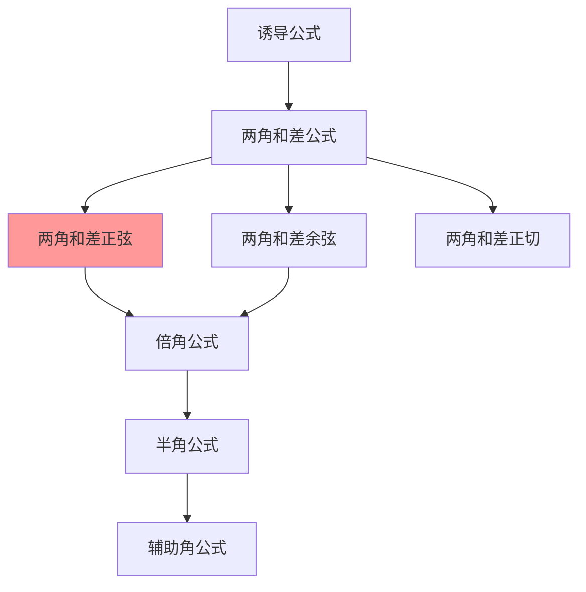

# 两角和与差的正弦公式

---

## 一、一句话大白话速懂

**两个角的正弦相加/相减，可以拆成四个单项的"交叉乘积"：sinαcosβ ± cosαsinβ。**

---

## 二、生活化场景类比

### 类比1：团队合作的"交叉配合"

想象两个团队（α团队和β团队）合作完成任务：
- α团队出"sin型人才"和"cos型人才"
- β团队也出"sin型人才"和"cos型人才"
- 最佳配合方式是**交叉组合**：α的sin配β的cos，α的cos配β的sin

### 类比2：化学的"交叉反应"

就像化学反应：
- A物质 + B物质 → AB化合物
- 两角和的正弦也是"交叉产物"：sinα·cosβ + cosα·sinβ

### 类比3：向量分解

一个力可以分解成两个垂直方向的分量：
- 两个角度叠加的效果 = 各自分量效果的叠加
- 这就是公式背后的物理直觉

---

## 三、上帝视角本源解析

### 1. 本源：为什么要研究两角和差公式？

**实际问题的需求**：
- 已知 $\sin 30°$ 和 $\sin 45°$，怎么求 $\sin 75°$？
- 75° = 30° + 45°，需要一个把"和角的三角函数"转化成"单角三角函数"的工具

**数学体系的需求**：
- 这是三角恒等变换的"基石公式"
- 后续的倍角公式、半角公式都可以由它推导

### 2. 本质：公式到底在说什么？

**本质是"叠加原理"**。

两个角度叠加后的正弦值，不等于各自正弦值的简单叠加，而是需要考虑它们的"交叉影响"。

$$
\sin(\alpha + \beta) \neq \sin\alpha + \sin\beta
$$

正确的关系：
$$
\sin(\alpha + \beta) = \sin\alpha\cos\beta + \cos\alpha\sin\beta
$$

### 3. 边界：什么时候能用，什么时候不能用？

| 适用场景 | 不适用场景 |
|:---:|:---:|
| 已知单角求和差角的正弦 | 角的和差关系不明确 |
| 化简复杂的三角函数式 | 需要求精确数值但单角值未知 |
| 证明三角恒等式 | 角的范围超出定义域 |

### 4. 体系定位

```
诱导公式
    ↓
两角和差公式 ← 你现在在这里
    ↓
倍角公式、半角公式
    ↓
辅助角公式
    ↓
三角函数综合应用
```

---

## 四、知识点精准拆解

### 4.1 两角和的正弦公式

**公式**：
$$
\sin(\alpha + \beta) = \sin\alpha\cos\beta + \cos\alpha\sin\beta
$$

**符号拆解**：
- 左边：两个角**相加**后的正弦
- 右边：第一项 $\sin\alpha\cos\beta$（第一个角的sin × 第二个角的cos）
- 右边：第二项 $\cos\alpha\sin\beta$（第一个角的cos × 第二个角的sin）
- 中间是**加号**

**记忆口诀**："正弦和 = 正余加余正"

### 4.2 两角差的正弦公式

**公式**：
$$
\sin(\alpha - \beta) = \sin\alpha\cos\beta - \cos\alpha\sin\beta
$$

**符号拆解**：
- 左边：两个角**相减**后的正弦
- 右边结构相同，但中间是**减号**

**记忆口诀**："正弦差 = 正余减余正"

### 4.3 公式对比记忆

| 公式 | 结构 | 符号 |
|:---:|:---:|:---:|
| $\sin(\alpha + \beta)$ | $\sin\alpha\cos\beta + \cos\alpha\sin\beta$ | 加 |
| $\sin(\alpha - \beta)$ | $\sin\alpha\cos\beta - \cos\alpha\sin\beta$ | 减 |

**规律**：
- 括号内是"+"，展开后也是"+"
- 括号内是"-"，展开后也是"-"
- **符号一致原则**

### 4.4 几何推导（单位圆法）

**思路**：利用单位圆上点的坐标和旋转矩阵

设点P在单位圆上，角度为α+β：
- P的坐标：$(\cos(\alpha+\beta), \sin(\alpha+\beta))$

也可以看作：先转α，再转β
- 旋转矩阵的复合 → 得到和角公式

（详细推导过程略，高考主要考查应用而非推导）

---

## 五、全体系逻辑关系



**核心地位**：
- 两角和差公式是三角恒等变换的"母公式"
- 几乎所有其他公式都可以由它推导

---

## 六、零基础入门例题

### 例题1：直接套用公式

**题目**：求 $\sin 75°$ 的值。

**解析**：

**Step 1：拆角**
- $75° = 30° + 45°$
- 设 $\alpha = 30°$，$\beta = 45°$

**Step 2：套公式**
$$
\sin 75° = \sin(30° + 45°) = \sin 30°\cos 45° + \cos 30°\sin 45°
$$

**Step 3：代入特殊角值**
$$
= \frac{1}{2} · \frac{\sqrt{2}}{2} + \frac{\sqrt{3}}{2} · \frac{\sqrt{2}}{2}
$$
$$
= \frac{\sqrt{2}}{4} + \frac{\sqrt{6}}{4}
$$
$$
= \frac{\sqrt{2} + \sqrt{6}}{4}
$$

**答案**：$\sin 75° = \frac{\sqrt{6} + \sqrt{2}}{4}$

---

### 例题2：两角差的应用

**题目**：求 $\sin 15°$ 的值。

**解析**：

**Step 1：拆角**
- $15° = 45° - 30°$（或 $60° - 45°$）
- 设 $\alpha = 45°$，$\beta = 30°$

**Step 2：套公式**
$$
\sin 15° = \sin(45° - 30°) = \sin 45°\cos 30° - \cos 45°\sin 30°
$$

**Step 3：代入计算**
$$
= \frac{\sqrt{2}}{2} · \frac{\sqrt{3}}{2} - \frac{\sqrt{2}}{2} · \frac{1}{2}
$$
$$
= \frac{\sqrt{6}}{4} - \frac{\sqrt{2}}{4}
$$
$$
= \frac{\sqrt{6} - \sqrt{2}}{4}
$$

**答案**：$\sin 15° = \frac{\sqrt{6} - \sqrt{2}}{4}$

---

### 例题3：已知条件求值

**题目**：已知 $\sin\alpha = \frac{3}{5}$，$\alpha \in (0°, 90°)$，$\cos\beta = -\frac{5}{13}$，$\beta \in (90°, 180°)$，求 $\sin(\alpha + \beta)$。

**解析**：

**Step 1：求cosα**
$$
\cos\alpha = \sqrt{1 - \sin^2\alpha} = \sqrt{1 - \frac{9}{25}} = \sqrt{\frac{16}{25}} = \frac{4}{5}
$$
（α在第一象限，cos为正）

**Step 2：求sinβ**
$$
\sin\beta = \sqrt{1 - \cos^2\beta} = \sqrt{1 - \frac{25}{169}} = \sqrt{\frac{144}{169}} = \frac{12}{13}
$$
（β在第二象限，sin为正）

**Step 3：套公式**
$$
\sin(\alpha + \beta) = \sin\alpha\cos\beta + \cos\alpha\sin\beta
$$
$$
= \frac{3}{5} · \left(-\frac{5}{13}\right) + \frac{4}{5} · \frac{12}{13}
$$
$$
= -\frac{15}{65} + \frac{48}{65}
$$
$$
= \frac{33}{65}
$$

---

### 例题4：化简求值

**题目**：化简 $\sin(x + 30°)\cos x - \cos(x + 30°)\sin x$

**解析**：

**观察结构**：这正好是两角差公式的形式！

**逆用公式**：
$$
\sin A\cos B - \cos A\sin B = \sin(A - B)
$$

令 $A = x + 30°$，$B = x$：
$$
\text{原式} = \sin[(x + 30°) - x] = \sin 30° = \frac{1}{2}
$$

**技巧总结**：看到 $\sin\cos - \cos\sin$ 的结构，想到逆用差角公式。

---

## 七、文科生高频易错雷区

### 雷区1：符号记错

**错误**：$\sin(\alpha - \beta) = \sin\alpha\cos\beta + \cos\alpha\sin\beta$

**正确**：$\sin(\alpha - \beta) = \sin\alpha\cos\beta - \cos\alpha\sin\beta$

**记忆技巧**：
- sin的公式，符号**一致**：括号内是"-"，展开也是"-"
- （对比cos的公式，符号相反）

### 雷区2：顺序记错

**错误**：$\sin(\alpha + \beta) = \sin\alpha\sin\beta + \cos\alpha\cos\beta$

**正确**：$\sin(\alpha + \beta) = \sin\alpha\cos\beta + \cos\alpha\sin\beta$

**记忆技巧**：
- sin的公式是"交叉相乘"：sinα·cosβ + cosα·sinβ
- 不是"同项相乘"（那是cos的公式）

### 雷区3：忘记判断符号

**错误**：已知 $\sin\alpha = \frac{3}{5}$，直接写 $\cos\alpha = \frac{4}{5}$

**正确做法**：
- 必须先确定α所在象限
- 如果α在第二象限，$\cos\alpha = -\frac{4}{5}$

### 雷区4：混淆sin和cos的公式

**错误记忆**：
- $\sin(\alpha + \beta) = \sin\alpha\sin\beta - \cos\alpha\cos\beta$（这是-cos的公式）

**区分记忆**：
| 函数 | 公式特点 |
|:---:|:---:|
| sin | 交叉相乘，符号一致 |
| cos | 同项相乘，符号相反 |

---

## 八、高考考点提示

### 考查频率：⭐⭐⭐⭐⭐（必考核心）

### 常见考法：

| 题型 | 分值 | 难度 |
|:---:|:---:|:---:|
| 求特殊角的三角函数值 | 4-5分 | ⭐⭐ |
| 已知条件求值 | 4-5分 | ⭐⭐⭐ |
| 化简证明 | 4-5分 | ⭐⭐⭐ |

### 高考真题示例（改编）：

**题目**（2023全国卷）：已知 $\sin\alpha = \frac{1}{3}$，$\cos\beta = \frac{2}{3}$，且α、β都是锐角，求 $\sin(\alpha + \beta)$。

**答案**：$\frac{2\sqrt{2} + 2\sqrt{5}}{9}$

**解析**：
- $\cos\alpha = \sqrt{1 - \frac{1}{9}} = \frac{2\sqrt{2}}{3}$
- $\sin\beta = \sqrt{1 - \frac{4}{9}} = \frac{\sqrt{5}}{3}$
- $\sin(\alpha + \beta) = \frac{1}{3}·\frac{2}{3} + \frac{2\sqrt{2}}{3}·\frac{\sqrt{5}}{3} = \frac{2 + 2\sqrt{10}}{9}$

### 备考建议：
1. 熟记两角和差正弦公式
2. 注意与cos公式的区分
3. 掌握逆用公式的技巧
4. 计算时注意符号判断

---

> 📌 **学习总结**：两角和差的正弦公式是三角恒等变换的核心。记住"正余加余正"的口诀，注意符号一致性，配合准确的计算，就能顺利解决相关问题。
