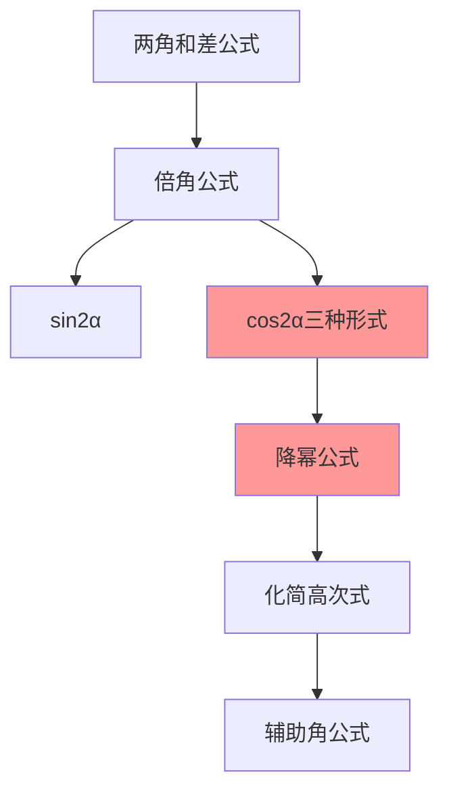

# 二倍角的余弦公式

---

## 一、一句话大白话速懂

**一个角的两倍角的余弦，有三种表达形式：可以用cos²α-sin²α，也可以用2cos²α-1，还可以用1-2sin²α。**

---

## 二、生活化场景类比

### 类比1：三种不同的"身份证"

就像一个人可以有：
- 身份证
- 护照
- 驾驶证

都是同一个人，但不同场合用不同的证件。

cos2α也有三种形式，不同题目用不同的形式更方便。

### 类比2：三角形的不同表示

一个三角形可以用：
- 三个边表示
- 两边夹角表示
- 一边两角表示

cos2α的三种形式也是同样的道理——从不同角度描述同一个量。

### 类比3：降幂升角的"变形术"

- 从$\cos^2\alpha$到$\cos 2\alpha$：降幂（2次→1次），升角（α→2α）
- 这是化简三角函数式的核心技巧

---

## 三、上帝视角本源解析

### 1. 本源：为什么要研究cos2α的多种形式？

**化简需求**：

- 有的题目只有cos，用$2\cos^2\alpha - 1$方便
- 有的题目只有sin，用$1 - 2\sin^2\alpha$方便
- 有的题目两者都有，用$\cos^2\alpha - \sin^2\alpha$方便

**降幂需求**：
- 高次幂（如$\cos^4\alpha$）很难处理
- 通过cos2α可以降幂，简化计算

### 2. 本质：三种形式的关系

**本质都是同一个公式，只是用平方关系替换了不同的项**。

$$
\cos^2\alpha - \sin^2\alpha = \cos^2\alpha - (1 - \cos^2\alpha) = 2\cos^2\alpha - 1
$$

$$
\cos^2\alpha - \sin^2\alpha = (1 - \sin^2\alpha) - \sin^2\alpha = 1 - 2\sin^2\alpha
$$

### 3. 边界：什么时候用哪种形式？

| 场景 | 推荐形式 |
|:---:|:---:|
| 已知cosα，求cos2α | $2\cos^2\alpha - 1$ |
| 已知sinα，求cos2α | $1 - 2\sin^2\alpha$ |
| 化简含$\cos^2\alpha - \sin^2\alpha$的式子 | $\cos^2\alpha - \sin^2\alpha$ |
| 降幂（$\cos^2\alpha → \cos 2\alpha$）| $2\cos^2\alpha - 1$ |

### 4. 体系定位

```
两角和差公式
    ↓
倍角公式
    ↓
cos2α的三种形式 ← 你现在在这里
    ↓
降幂公式
    ↓
辅助角公式
```

---

## 四、知识点精准拆解

### 4.1 三种形式

**形式一**：
$$
\cos 2\alpha = \cos^2\alpha - \sin^2\alpha
$$

**形式二**：
$$
\cos 2\alpha = 2\cos^2\alpha - 1
$$

**形式三**：
$$
\cos 2\alpha = 1 - 2\sin^2\alpha
$$

### 4.2 推导过程

**基础推导**（由和角公式）：

令 $\beta = \alpha$，代入余弦和角公式：
$$
\cos(\alpha + \beta) = \cos\alpha\cos\beta - \sin\alpha\sin\beta
$$
$$
\cos 2\alpha = \cos^2\alpha - \sin^2\alpha \quad \text{（形式一）}
$$

**推导形式二**：
$$
\cos 2\alpha = \cos^2\alpha - \sin^2\alpha = \cos^2\alpha - (1 - \cos^2\alpha) = 2\cos^2\alpha - 1
$$

**推导形式三**：
$$
\cos 2\alpha = \cos^2\alpha - \sin^2\alpha = (1 - \sin^2\alpha) - \sin^2\alpha = 1 - 2\sin^2\alpha
$$

### 4.3 降幂公式（重要！）

由cos2α的公式变形得到：

$$
\cos^2\alpha = \frac{1 + \cos 2\alpha}{2}
$$

$$
\sin^2\alpha = \frac{1 - \cos 2\alpha}{2}
$$

**用途**：把二次幂降为一次，简化计算

---

## 五、全体系逻辑关系



**核心功能**：
- 实现"角"的倍数转换
- 实现"幂"的降次（降幂公式）

---

## 六、零基础入门例题

### 例题1：直接套用公式

**题目**：已知 $\cos\alpha = \frac{3}{5}$，求 $\cos 2\alpha$。

**解析**：

**选择形式二**（因为有cosα）：
$$
\cos 2\alpha = 2\cos^2\alpha - 1 = 2 · \left(\frac{3}{5}\right)^2 - 1 = 2 · \frac{9}{25} - 1 = \frac{18}{25} - 1 = -\frac{7}{25}
$$

---

### 例题2：已知sin求cos2α

**题目**：已知 $\sin\alpha = \frac{1}{3}$，求 $\cos 2\alpha$。

**解析**：

**选择形式三**（因为有sinα）：
$$
\cos 2\alpha = 1 - 2\sin^2\alpha = 1 - 2 · \left(\frac{1}{3}\right)^2 = 1 - \frac{2}{9} = \frac{7}{9}
$$

---

### 例题3：降幂应用

**题目**：化简 $\cos^4\alpha - \sin^4\alpha$

**解析**：

**Step 1：因式分解**
$$
\cos^4\alpha - \sin^4\alpha = (\cos^2\alpha + \sin^2\alpha)(\cos^2\alpha - \sin^2\alpha)
$$

**Step 2：利用平方关系和倍角公式**
$$
= 1 · \cos 2\alpha = \cos 2\alpha
$$

**答案**：$\cos^4\alpha - \sin^4\alpha = \cos 2\alpha$

---

### 例题4：综合应用

**题目**：已知 $\sin\alpha + \cos\alpha = \frac{1}{2}$，求 $\cos 2\alpha$。

**解析**：

**方法一：先求sin2α，再求cos2α**

由例题4的经验：
$$
(\sin\alpha + \cos\alpha)^2 = 1 + \sin 2\alpha = \frac{1}{4}
$$
$$
\sin 2\alpha = -\frac{3}{4}
$$

再由平方关系：
$$
\cos^2 2\alpha = 1 - \sin^2 2\alpha = 1 - \frac{9}{16} = \frac{7}{16}
$$
$$
\cos 2\alpha = ±\frac{\sqrt{7}}{4}
$$

需要进一步判断符号...

**方法二：直接求**

由 $\sin\alpha + \cos\alpha = \frac{1}{2}$ 和 $\sin^2\alpha + \cos^2\alpha = 1$

可以解出 $\sin\alpha$ 和 $\cos\alpha$，再代入公式...

（略，较复杂）

---

### 例题5：降幂公式的应用

**题目**：化简 $\sin^2 15°$

**解析**：

**用降幂公式**：
$$
\sin^2 15° = \frac{1 - \cos 30°}{2} = \frac{1 - \frac{\sqrt{3}}{2}}{2} = \frac{2 - \sqrt{3}}{4}
$$

---

## 七、文科生高频易错雷区

### 雷区1：三种形式混淆

**错误**：已知sinα，却用$2\cos^2\alpha - 1$求cos2α

**正确做法**：
- 已知sinα → 用$1 - 2\sin^2\alpha$
- 已知cosα → 用$2\cos^2\alpha - 1$
- 两者都知道 → 用$\cos^2\alpha - \sin^2\alpha$

### 雷区2：符号错误

**错误**：$\cos 2\alpha = 2\sin^2\alpha - 1$

**正确**：$\cos 2\alpha = 1 - 2\sin^2\alpha$

**记忆**：sin²α前面是负号（因为sin²α ≤ 1）

### 雷区3：降幂公式记错

**错误**：$\cos^2\alpha = \frac{1 - \cos 2\alpha}{2}$

**正确**：$\cos^2\alpha = \frac{1 + \cos 2\alpha}{2}$

**记忆技巧**：
- $\cos^2\alpha$：cos是"正"的，所以用"+"
- $\sin^2\alpha$：sin是"负"的（相对cos），所以用"-"

### 雷区4：忘记cos2α的范围

**错误**：认为cos2α可以取任意值

**正确理解**：
- $-1 ≤ \cos 2\alpha ≤ 1$
- 这是余弦函数的基本性质

---

## 八、高考考点提示

### 考查频率：⭐⭐⭐⭐⭐（必考核心）

### 常见考法：

| 题型 | 分值 | 难度 |
|:---:|:---:|:---:|
| 直接求cos2α | 4-5分 | ⭐⭐ |
| 降幂化简 | 4-5分 | ⭐⭐⭐ |
| 综合应用 | 4-5分 | ⭐⭐⭐ |

### 高考真题示例（改编）：

**题目**（2021全国卷）：已知 $\sin\alpha = \frac{1}{3}$，则 $\cos 2\alpha =$（ ）

A. $\frac{7}{9}$  B. $-\frac{7}{9}$  C. $-\frac{8}{9}$  D. $\frac{8}{9}$

**答案**：A

**解析**：
$$
\cos 2\alpha = 1 - 2\sin^2\alpha = 1 - 2 · \frac{1}{9} = 1 - \frac{2}{9} = \frac{7}{9}
$$

### 备考建议：
1. 熟记cos2α的三种形式
2. 掌握降幂公式
3. 根据题目条件选择合适的形式
4. 注意符号不要搞错

---

> 📌 **学习总结**：二倍角的余弦公式有三种形式，是三角恒等变换的重要工具。记住"sin²用1-2sin²，cos²用2cos²-1"，配合降幂公式，就能灵活应对各种题目。
