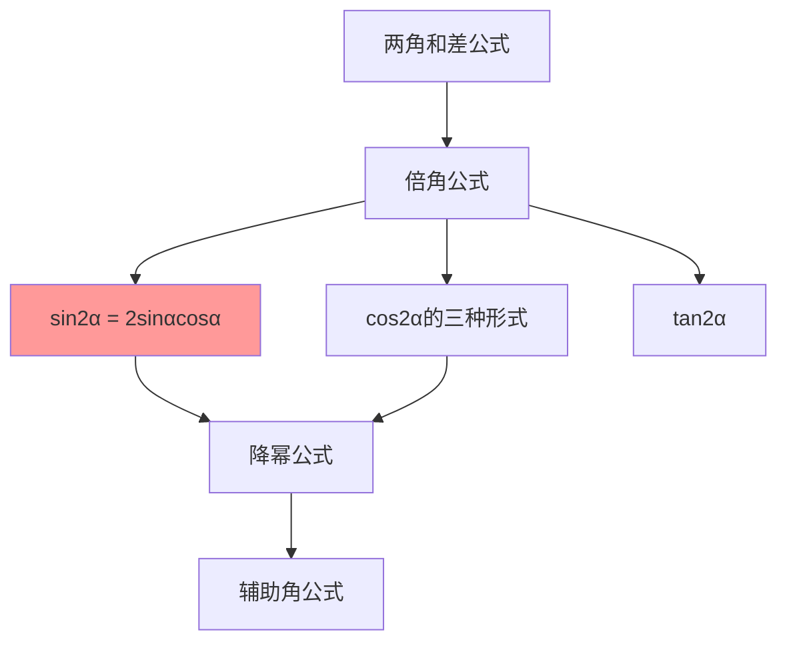

# 二倍角的正弦公式

---

## 一、一句话大白话速懂

**一个角的两倍角的正弦，等于2倍的这个角的正弦乘以余弦：sin2α = 2sinαcosα。**

---

## 二、生活化场景类比

### 类比1：翻倍的"交叉效应"

想象两个人合作：
- 一个人有"sin能力"，另一个人有"cos能力"
- 当工作量翻倍（2α）时，效率不是简单翻倍
- 而是需要考虑"交叉配合"：2 × sin能力 × cos能力

### 类比2：面积公式的启示

三角形面积公式：$S = \frac{1}{2}ab\sin C$

如果两边都变成原来的两倍，面积怎么变？这涉及到倍角关系！

### 类比3：物理中的共振

两个振动叠加时，产生的效应不是简单相加，而是有"乘积效应"：
- 这就像sin2α = 2sinαcosα中的乘法关系

---

## 三、上帝视角本源解析

### 1. 本源：为什么要研究倍角公式？

**简化计算的需求**：
- 已知 $\sin 30°$，怎么快速求 $\sin 60°$？
- 60° = 2 × 30°，需要一个"倍角"的转换公式

**数学推导的需求**：
- 倍角公式可以由和角公式推导（令β=α）
- 它是和角公式的"特例"，但应用更广泛

### 2. 本质：公式到底在说什么？

**本质是"一个角的二倍"与"这个角本身"之间的关系**。

注意：
$$
\sin 2\alpha \neq 2\sin\alpha
$$

正确的关系：
$$
\sin 2\alpha = 2\sin\alpha\cos\alpha
$$

**关键洞察**：二倍角的正弦不仅与sinα有关，还与cosα有关！

### 3. 边界：什么时候能用，什么时候不能用？

| 适用场景 | 不适用场景 |
|:---:|:---:|
| 已知单角求二倍角的正弦 | 角的倍数关系不明确 |
| 化简含sinαcosα的式子 | 需要单独求sinα或cosα |
| 降幂升角变换 | 角的范围导致符号不确定 |

### 4. 体系定位

```
两角和差公式
    ↓
倍角公式 ← 你现在在这里
    ↓
半角公式
    ↓
辅助角公式
    ↓
三角函数综合应用
```

---

## 四、知识点精准拆解

### 4.1 二倍角正弦公式

**公式**：
$$
\sin 2\alpha = 2\sin\alpha\cos\alpha
$$

**符号拆解**：
- 左边：角$\alpha$的**两倍**的正弦
- 右边：2 × sinα × cosα
- 注意：不是$2\sin\alpha$！

**推导过程**（由和角公式）：

令 $\beta = \alpha$，代入和角公式：
$$
\sin(\alpha + \beta) = \sin\alpha\cos\beta + \cos\alpha\sin\beta
$$
$$
\sin(\alpha + \alpha) = \sin\alpha\cos\alpha + \cos\alpha\sin\alpha
$$
$$
\sin 2\alpha = 2\sin\alpha\cos\alpha \quad \checkmark
$$

### 4.2 变形公式

**变形1：求sinαcosα**
$$
\sin\alpha\cos\alpha = \frac{1}{2}\sin 2\alpha
$$

**用途**：把乘积形式转化为单角形式，便于化简

**变形2：与平方关系结合**

由 $\sin 2\alpha = 2\sin\alpha\cos\alpha$ 和 $\sin^2\alpha + \cos^2\alpha = 1$：

可以推出：
$$
(\sin\alpha + \cos\alpha)^2 = 1 + \sin 2\alpha
$$
$$
(\sin\alpha - \cos\alpha)^2 = 1 - \sin 2\alpha
$$

### 4.3 常见应用场景

| 场景 | 方法 |
|:---:|:---:|
| 已知sinα和cosα，求sin2α | 直接套公式 |
| 已知sinαcosα，求sin2α | $\sin 2\alpha = 2\sin\alpha\cos\alpha$ |
| 化简sinαcosα | 化为$\frac{1}{2}\sin 2\alpha$ |

---

## 五、全体系逻辑关系



**核心功能**：
- 实现"角"的倍数转换（升角）
- 实现"幂"的降次（降幂）

---

## 六、零基础入门例题

### 例题1：直接套用公式

**题目**：已知 $\sin\alpha = \frac{3}{5}$，$\cos\alpha = \frac{4}{5}$，求 $\sin 2\alpha$。

**解析**：

**直接套公式**：
$$
\sin 2\alpha = 2\sin\alpha\cos\alpha = 2 · \frac{3}{5} · \frac{4}{5} = \frac{24}{25}
$$

**验证**：
- $\sin^2\alpha + \cos^2\alpha = \frac{9}{25} + \frac{16}{25} = 1$ ✓
- α在第一象限，2α可能在第一或第二象限
- $\sin 2\alpha = \frac{24}{25} > 0$，符合

---

### 例题2：已知tan求sin2α

**题目**：已知 $\tan\alpha = 2$，求 $\sin 2\alpha$。

**解析**：

**方法一：利用齐次式**

由 $\sin 2\alpha = 2\sin\alpha\cos\alpha$

分子分母同除以$\cos^2\alpha$：
$$
\sin 2\alpha = \frac{2\sin\alpha\cos\alpha}{\sin^2\alpha + \cos^2\alpha} = \frac{2\tan\alpha}{\tan^2\alpha + 1}
$$

**代入计算**：
$$
\sin 2\alpha = \frac{2 · 2}{2^2 + 1} = \frac{4}{5}
$$

**方法二：先求sinα和cosα**
- 由 $\tan\alpha = 2 = \frac{\sin\alpha}{\cos\alpha}$
- 设 $\sin\alpha = 2k$，$\cos\alpha = k$
- 由 $\sin^2\alpha + \cos^2\alpha = 1$：$4k^2 + k^2 = 1$，$k = \frac{1}{\sqrt{5}}$
- $\sin 2\alpha = 2 · \frac{2}{\sqrt{5}} · \frac{1}{\sqrt{5}} = \frac{4}{5}$

---

### 例题3：化简求值

**题目**：化简 $\frac{\sin 20°\cos 20°}{\sin 10°}$

**解析**：

**Step 1：分子用倍角公式**
$$
\sin 20°\cos 20° = \frac{1}{2}\sin 40°
$$

**Step 2：观察40°和10°的关系**
- $40° = 4 × 10°$，关系不明显
- 换个思路：$\sin 40° = 2\sin 20°\cos 20°$（循环了）

**重新思考**：
$$
\frac{\sin 20°\cos 20°}{\sin 10°} = \frac{\frac{1}{2}\sin 40°}{\sin 10°}
$$

利用 $\sin 40° = \cos 50°$ 和 $\sin 10° = \cos 80°$，暂时化简不了。

**更简单的方法**：
- $\sin 20°\cos 20° = \frac{1}{2}\sin 40°$
- 利用 $\sin 40° = 2\sin 20°\cos 20°$（验证公式）

这道题的答案是 $\cos 10°$，需要更复杂的变换。

---

### 例题4：综合应用

**题目**：已知 $\sin\alpha + \cos\alpha = \frac{1}{2}$，求 $\sin 2\alpha$。

**解析**：

**Step 1：两边平方**
$$
(\sin\alpha + \cos\alpha)^2 = \left(\frac{1}{2}\right)^2
$$

**Step 2：展开**
$$
\sin^2\alpha + 2\sin\alpha\cos\alpha + \cos^2\alpha = \frac{1}{4}
$$

**Step 3：利用平方关系和倍角公式**
$$
1 + \sin 2\alpha = \frac{1}{4}
$$

**Step 4：求解**
$$
\sin 2\alpha = \frac{1}{4} - 1 = -\frac{3}{4}
$$

**技巧总结**：看到$\sin\alpha + \cos\alpha$，想到平方后用倍角公式。

---

## 七、文科生高频易错雷区

### 雷区1：混淆sin2α和2sinα

**错误**：$\sin 2\alpha = 2\sin\alpha$

**正确**：$\sin 2\alpha = 2\sin\alpha\cos\alpha$

**记忆技巧**：
- sin2α ≠ 2sinα（除非cosα=1，即α=0°）
- 类比：$(a+b)^2 \neq a^2 + b^2$

### 雷区2：忘记系数2

**错误**：$\sin 2\alpha = \sin\alpha\cos\alpha$

**正确**：$\sin 2\alpha = 2\sin\alpha\cos\alpha$

**记忆**：公式前面有个"2"！

### 雷区3：符号判断错误

**错误**：已知 $\sin\alpha = \frac{1}{2}$，$\cos\alpha = -\frac{\sqrt{3}}{2}$，求sin2α时符号搞错

**正确做法**：
- $\sin 2\alpha = 2 · \frac{1}{2} · (-\frac{\sqrt{3}}{2}) = -\frac{\sqrt{3}}{2}$
- α在第二象限，2α可能在第三或第四象限
- 需要进一步判断2α的具体范围

### 雷区4：变形方向搞错

**错误**：看到$\sin\alpha\cos\alpha$不知道可以化为$\frac{1}{2}\sin 2\alpha$

**正确理解**：
- 升角降幂：$\sin\alpha\cos\alpha → \frac{1}{2}\sin 2\alpha$
- 这是化简的重要技巧

---

## 八、高考考点提示

### 考查频率：⭐⭐⭐⭐⭐（必考核心）

### 常见考法：

| 题型 | 分值 | 难度 |
|:---:|:---:|:---:|
| 直接求sin2α | 4-5分 | ⭐⭐ |
| 已知sinα+cosα求sin2α | 4-5分 | ⭐⭐⭐ |
| 化简证明 | 4-5分 | ⭐⭐⭐ |

### 高考真题示例（改编）：

**题目**（2022全国卷）：已知 $\sin\alpha - \cos\alpha = \frac{4}{3}$，则 $\sin 2\alpha =$（ ）

A. $-\frac{7}{9}$  B. $-\frac{2}{9}$  C. $\frac{2}{9}$  D. $\frac{7}{9}$

**答案**：A

**解析**：
- 两边平方：$(\sin\alpha - \cos\alpha)^2 = \frac{16}{9}$
- $1 - 2\sin\alpha\cos\alpha = \frac{16}{9}$
- $1 - \sin 2\alpha = \frac{16}{9}$
- $\sin 2\alpha = 1 - \frac{16}{9} = -\frac{7}{9}$

### 备考建议：
1. 熟记公式 $\sin 2\alpha = 2\sin\alpha\cos\alpha$
2. 掌握变形公式 $\sin\alpha\cos\alpha = \frac{1}{2}\sin 2\alpha$
3. 记住$(\sin\alpha ± \cos\alpha)^2 = 1 ± \sin 2\alpha$的技巧
4. 注意与cos2α的三种形式配合使用

---

> 📌 **学习总结**：二倍角的正弦公式是三角恒等变换的基础工具。记住公式 $\sin 2\alpha = 2\sin\alpha\cos\alpha$，掌握其与$(\sin\alpha ± \cos\alpha)^2$的关系，就能解决大部分相关问题。
