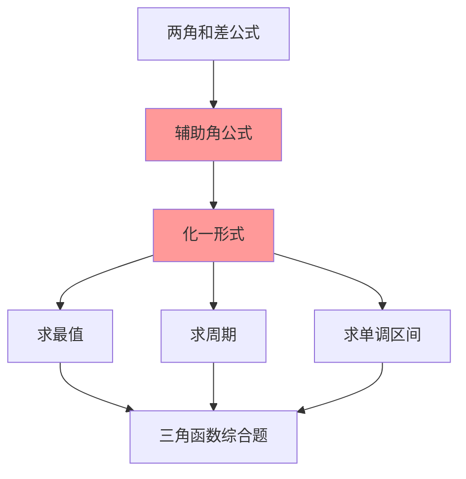

# 辅助角公式

---

## 一、一句话大白话速懂

**辅助角公式${a}\cdot\sin{x}+{b}\cdot\cos{x}$能把这种"混搭"形式，转化成$\sqrt[2]{a^2 + b^2} \cdot \sin{(x+φ)}$这种"纯正弦"形式，方便求最值和周期。**

---

## 二、生活化场景类比

### 类比1：调酒的"融合"

想象调酒师调一杯鸡尾酒：
- ${a}\cdot\sin{x}$像伏特加
- ${b}\cdot\cos{x}$ 像橙汁
- 混合后，用辅助角公式"摇匀"成一杯完美的酒

### 类比2：力的合成

物理学中：
- 两个力$F_1$和$F_2$可以合成一个合力F
- $a\cdot\sin{x}+b\cdot\cos{x}$ 就像两个垂直方向的力
- 合成后是一个单一方向的"等效力"

### 类比3：声音的"和声"

- $\sin{x}$和$\cos{x}$像两个不同频率的声音
- 叠加后形成一个新的"和声"
- 辅助角公式就是把这个和声"标准化"

---

## 三、上帝视角本源解析

### 1. 本源：为什么要研究辅助角公式？

**求最值的需求**：
- $y=\sin{x}+\cos{x}$的最大值是多少？
- 直接看不太清楚
- 转化成$y=\sqrt{2\cdot\sin{(x+45\degree)}}$ ，最大值一目了然：$\sqrt2$

**统一形式的需求**：

- 把不同三角函数的混合形式统一成正弦（或余弦）形式
- 便于分析周期性、单调性、最值

### 2. 本质：公式到底在做什么？

**本质是"提取公因式" + "三角恒等变换"**。

把 $a\sin x + b\cos x$ 中的 $\sqrt{a^2+b^2}$ 提取出来，剩下的部分凑成某个角的正弦。

### 3. 边界：什么时候能用，什么时候不能用？

| 适用场景 | 不适用场景 |
|:---:|:---:|
| $a\cdot\sin{x}+b\cdot\cos{x}$形式 | 含$\sin^2{x}$、$\cos^2{x}$等高次项 |
| 求最值、周期、单调区间 | 系数a、b都是0 |
| 解三角方程 | 角度不同（如$\sin{x}+\cos{2x}$） |

### 4. 体系定位

```
两角和差公式
    ↓
倍角公式
    ↓
降幂公式
    ↓
辅助角公式 ← 你现在在这里
    ↓
三角函数综合应用
    ↓
解三角形
```

---

## 四、知识点精准拆解

### 4.1 基本公式

**公式**：
$$
a\sin x + b\cos x = \sqrt{a^2 + b^2} \sin(x + \varphi)
$$

其中：
$$
\tan\varphi = \frac{b}{a}
$$

**符号拆解**：
- 左边：$a$倍的$\sin{x}$ 加上$b$倍的$\cos{x}$
- 右边：振幅$\sqrt{a^2+b^2}$ 乘以 sin(x+辅助角φ)
- 辅助角φ满足：$\tan\varphi = \frac{b}{a}$

### 4.2 推导过程

**Step 1：提取公因式**

设 $R = \sqrt{a^2 + b^2}$

$$
a\sin x + b\cos x = R\left(\frac{a}{R}\sin x + \frac{b}{R}\cos x\right)
$$

**Step 2：构造三角函数**

令 $\cos\varphi = \frac{a}{R}$，$\sin\varphi = \frac{b}{R}$

验证：$\cos^2\varphi + \sin^2\varphi = \frac{a^2}{R^2} + \frac{b^2}{R^2} = \frac{a^2+b^2}{R^2} = 1$ ✓

**Step 3：应用和角公式**

$$
R(\cos\varphi\sin x + \sin\varphi\cos x) = R\sin(x + \varphi)
$$

### 4.3 辅助角$φ$的确定

| 条件 | $φ$的位置 |
|:---:|:---:|
| a > 0, b > 0 | 第一象限 |
| a < 0, b > 0 | 第二象限 |
| a < 0, b < 0 | 第三象限 |
| a > 0, b < 0 | 第四象限 |

**记忆**：$(a, b)$ 这个点在第几象限，$φ$就在第几象限

### 4.4 变形公式

也可以化成余弦形式：
$$
a\sin x + b\cos x = \sqrt{a^2 + b^2} \cos(x - \theta)
$$

其中 $\tan\theta = \frac{a}{b}$

---

## 五、全体系逻辑关系



**核心功能**：
- 把混合形式统一成单一三角函数形式
- 便于分析函数性质

---

## 六、零基础入门例题

### 例题1：基础应用

**题目**：将 $\sin x + \cos x$ 化成 $A\sin(x + \varphi)$ 的形式。

**解析**：

**Step 1：确定系数**
- a = 1，b = 1

**Step 2：计算振幅**
$$
A = \sqrt{a^2 + b^2} = \sqrt{1 + 1} = \sqrt{2}
$$

**Step 3：确定辅助角**
$$
\tan\varphi = \frac{b}{a} = \frac{1}{1} = 1
$$
- a > 0, b > 0，φ在第一象限
- $\varphi = 45\degree = \frac{\pi}{4}$

**Step 4：写出结果**
$$
\sin x + \cos x = \sqrt{2}\sin\left(x + \frac{\pi}{4}\right)
$$

**验证**：
$$
\sqrt{2}\sin(x + 45°) = \sqrt{2}(\sin x \cos 45° + \cos x \sin 45°)
$$

$$
= \sqrt{2}\left(\sin x · \frac{\sqrt{2}}{2} + \cos x · \frac{\sqrt{2}}{2}\right) = \sin x + \cos x \quad \checkmark
$$

---

### 例题2：求最值

**题目**：求函数 $y = 3\sin x + 4\cos x$ 的最大值和最小值。

**解析**：

**Step 1：用辅助角公式**
- a = 3，b = 4
- $A = \sqrt{9 + 16} = 5$
- $\tan\varphi = \frac{4}{3}$

$$
y = 5\sin(x + \varphi)
$$

**Step 2：求最值**
- $\sin(x + \varphi)$ 的范围是 $[-1, 1]$
- y的最大值 = 5 × 1 = **5**
- y的最小值 = 5 × (-1) = **-5**

---

### 例题3：含系数的化简

**题目**：将 $\sqrt{3}\sin x + \cos x$ 化成 $A\sin(x + \varphi)$ 的形式。

**解析**：

**Step 1：确定系数**
- a = √3，b = 1

**Step 2：计算振幅**
$$
A = \sqrt{3 + 1} = 2
$$

**Step 3：确定辅助角**
$$
\tan\varphi = \frac{1}{\sqrt{3}} = \frac{\sqrt{3}}{3}
$$
- φ在第一象限
- $\varphi = 30° = \frac{\pi}{6}$

**Step 4：写出结果**
$$
\sqrt{3}\sin x + \cos x = 2\sin\left(x + \frac{\pi}{6}\right)
$$

---

### 例题4：综合应用

**题目**：求函数 $y = \sin x + \sqrt{3}\cos x$ 的周期、最大值和单调递增区间。

**解析**：

**Step 1：化一**
- a = 1，b = √3
- $A = \sqrt{1 + 3} = 2$
- $\tan\varphi = \sqrt{3}$，$\varphi = 60° = \frac{\pi}{3}$

$$
y = 2\sin\left(x + \frac{\pi}{3}\right)
$$

**Step 2：分析性质**
- **周期**：$T = 2\pi$
- **最大值**：2
- **单调递增区间**：
  - 令 $-\frac{\pi}{2} + 2k\pi ≤ x + \frac{\pi}{3} ≤ \frac{\pi}{2} + 2k\pi$
  - 解得：$-\frac{5\pi}{6} + 2k\pi ≤ x ≤ \frac{\pi}{6} + 2k\pi$

---

## 七、文科生高频易错雷区

### 雷区1：辅助角计算错误

**错误**：$\tan\varphi = \frac{a}{b}$

**正确**：$\tan\varphi = \frac{b}{a}$

**记忆技巧**：
- sin的系数是a，cos的系数是b
- tanφ = cos的系数 / sin的系数 = b/a

### 雷区2：忘记判断φ的象限

**错误**：$\tan\varphi = 1$，直接写$\varphi = 45°$

**正确做法**：
- 如果a < 0, b < 0，φ在第三象限
- 此时$\varphi = 225°$（或-135°）

### 雷区3：振幅计算错误

**错误**：$A = a + b$

**正确**：$A = \sqrt{a^2 + b^2}$

**记忆**：勾股定理！

### 雷区4：混淆sin和cos形式

**错误**：$a\sin x + b\cos x = \sqrt{a^2+b^2}\cos(x + \varphi)$

**正确**：
- 化成sin形式：$\sqrt{a^2+b^2}\sin(x + \varphi)$
- 化成cos形式：$\sqrt{a^2+b^2}\cos(x - \theta)$

注意符号变化！

---

## 八、高考考点提示

### 考查频率：⭐⭐⭐⭐⭐（必考核心）

### 常见考法：

| 题型 | 分值 | 难度 |
|:---:|:---:|:---:|
| 化一形式 | 4-5分 | ⭐⭐ |
| 求最值 | 4-5分 | ⭐⭐ |
| 求周期、单调区间 | 4-5分 | ⭐⭐⭐ |

### 高考真题示例（改编）：

**题目**（2023全国卷）：函数 $f(x) = \sin x - \cos x$ 的最大值为____。

**答案**：$\sqrt{2}$

**解析**：
- $a = 1$，$b = -1$
- $A = \sqrt{1 + 1} = \sqrt{2}$
- 最大值 = $\sqrt{2}$

### 备考建议：
1. 熟记辅助角公式
2. 掌握辅助角的确定方法
3. 学会用化一后的形式分析函数性质
4. 注意φ的象限判断

---

> 📌 **学习总结**：辅助角公式是三角函数化简的"终极武器"。记住公式$a\sin x + b\cos x = \sqrt{a^2+b^2}\sin(x+\varphi)$，掌握辅助角的确定方法，就能解决最值、周期等综合问题。
