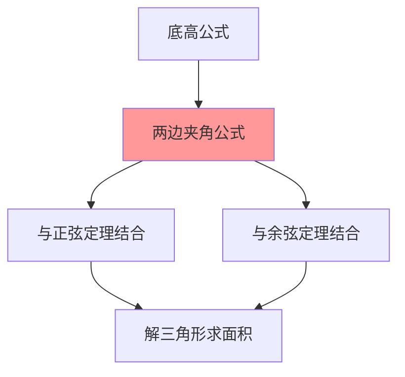

# 三角形面积公式

---

## 一、一句话大白话速懂

**三角形的面积可以用"两边夹角的正弦的一半"来算：S = (1/2)ab·sinC，这比底乘高除以2更通用，因为不需要知道高！**

---

## 二、生活化场景类比

### 类比1：平行四边形的"一半"

两个全等的三角形可以拼成一个平行四边形：
- 平行四边形面积 = 底 × 高
- 三角形面积 = (底 × 高) ÷ 2

### 类比2：向量叉积的几何意义

两个向量"叉乘"的模 = 以这两个向量为邻边的平行四边形面积

三角形面积就是这个的一半！

### 类比3：实际测量

测量一块三角形土地：
- 量两条边和夹角（容易）
- 用公式 $S = \frac{1}{2}ab\sin C$ 算面积
- 不用量高（可能很难量）

---

## 三、上帝视角本源解析

### 1. 本源：为什么要研究面积公式？

**实际测量的需求**：
- 底×高÷2 需要知道高
- 但高往往很难直接测量
- 需要一种只用边和角就能算面积的方法

**数学体系的需求**：
- 面积是三角形的重要属性
- 与正弦定理、余弦定理形成完整体系

### 2. 本质：面积公式到底在说什么？

**本质是"两边夹角"与面积的关系**。

面积 = $\frac{1}{2}$ × 两边乘积 × 夹角的正弦

为什么有正弦？因为高 = 边 × sin(夹角)！

### 3. 边界：什么时候用哪种公式？

| 已知条件 | 推荐公式 |
|:---:|:---:|
| 底和高 | $S = \frac{1}{2}ah$ |
| 两边夹角 | $S = \frac{1}{2}ab\sin C$ |
| 三边 | 海伦公式 |
| 一边和两角 | 先用正弦定理求边，再用面积公式 |

### 4. 体系定位

```
正弦定理
    ↓
余弦定理
    ↓
三角形面积公式 ← 你现在在这里
    ↓
解三角形综合应用
```

---

## 四、知识点精准拆解

### 4.1 基本面积公式

**公式一（底高公式）**：
$$
S = \frac{1}{2}ah_a = \frac{1}{2}bh_b = \frac{1}{2}ch_c
$$

其中 $h_a, h_b, h_c$ 分别是三边上的高。

**公式二（两边夹角公式）**：
$$
S = \frac{1}{2}ab\sin C = \frac{1}{2}bc\sin A = \frac{1}{2}ac\sin B
$$

### 4.2 推导过程

**由底高公式推导**：

在△ABC中，设h是边a上的高。

由三角函数：$h = c\sin B = b\sin C$

所以：
$$
S = \frac{1}{2}ah = \frac{1}{2}ac\sin B = \frac{1}{2}ab\sin C
$$

### 4.3 海伦公式（补充）

已知三边a, b, c，求面积：

设半周长 $p = \frac{a+b+c}{2}$

$$
S = \sqrt{p(p-a)(p-b)(p-c)}
$$

### 4.4 与正弦定理的关系

由正弦定理：$\frac{a}{\sin A} = \frac{b}{\sin B} = \frac{c}{\sin C} = 2R$

可以得到：
$$
S = \frac{1}{2}ab\sin C = \frac{1}{2} · 2R\sin A · 2R\sin B · \sin C = 2R^2\sin A\sin B\sin C
$$

---

## 五、全体系逻辑关系



**核心功能**：
- 已知两边夹角求面积
- 与正余弦定理配合求面积

---

## 六、零基础入门例题

### 例题1：已知两边夹角

**题目**：在△ABC中，已知a = 4，b = 5，C = 30°，求三角形面积。

**解析**：

**Step 1：选择公式**
- 已知两边a、b和夹角C
- 用公式 $S = \frac{1}{2}ab\sin C$

**Step 2：代入计算**
$$
S = \frac{1}{2} · 4 · 5 · \sin 30°
$$
$$
S = \frac{1}{2} · 20 · \frac{1}{2} = 5
$$

**答案**：面积 = 5

---

### 例题2：已知两角一边

**题目**：在△ABC中，已知A = 30°，B = 45°，c = 4，求三角形面积。

**解析**：

**Step 1：求第三角**
$$
C = 180° - 30° - 45° = 105°
$$

**Step 2：用正弦定理求边**
$$
\frac{a}{\sin A} = \frac{c}{\sin C}
$$
$$
a = \frac{c\sin A}{\sin C} = \frac{4 · \sin 30°}{\sin 105°}
$$

**Step 3：计算sin105°**
$$
\sin 105° = \sin(60° + 45°) = \sin 60°\cos 45° + \cos 60°\sin 45°
$$
$$
= \frac{\sqrt{3}}{2} · \frac{\sqrt{2}}{2} + \frac{1}{2} · \frac{\sqrt{2}}{2} = \frac{\sqrt{6} + \sqrt{2}}{4}
$$

**Step 4：计算a**
$$
a = \frac{4 · \frac{1}{2}}{\frac{\sqrt{6} + \sqrt{2}}{4}} = \frac{2 · 4}{\sqrt{6} + \sqrt{2}} = \frac{8}{\sqrt{6} + \sqrt{2}}
$$

有理化：
$$
a = \frac{8(\sqrt{6} - \sqrt{2})}{6 - 2} = 2(\sqrt{6} - \sqrt{2})
$$

**Step 5：求面积**
$$
S = \frac{1}{2}ac\sin B = \frac{1}{2} · 2(\sqrt{6} - \sqrt{2}) · 4 · \sin 45°
$$
$$
= 4(\sqrt{6} - \sqrt{2}) · \frac{\sqrt{2}}{2} = 2\sqrt{2}(\sqrt{6} - \sqrt{2})
$$
$$
= 2\sqrt{12} - 4 = 4\sqrt{3} - 4
$$

---

### 例题3：已知三边

**题目**：在△ABC中，已知a = 5，b = 6，c = 7，求三角形面积。

**解析**：

**方法一：海伦公式**

**Step 1：计算半周长**
$$
p = \frac{5 + 6 + 7}{2} = 9
$$

**Step 2：代入海伦公式**
$$
S = \sqrt{9(9-5)(9-6)(9-7)} = \sqrt{9 · 4 · 3 · 2} = \sqrt{216} = 6\sqrt{6}
$$

**方法二：先用余弦定理求角，再用面积公式**

**Step 1：求cosC**
$$
\cos C = \frac{a^2 + b^2 - c^2}{2ab} = \frac{25 + 36 - 49}{60} = \frac{12}{60} = \frac{1}{5}
$$

**Step 2：求sinC**
$$
\sin C = \sqrt{1 - \frac{1}{25}} = \sqrt{\frac{24}{25}} = \frac{2\sqrt{6}}{5}
$$

**Step 3：求面积**
$$
S = \frac{1}{2}ab\sin C = \frac{1}{2} · 5 · 6 · \frac{2\sqrt{6}}{5} = 6\sqrt{6}
$$

---

### 例题4：综合应用

**题目**：在△ABC中，已知a = 2，B = 60°，面积为$\sqrt{3}$，求b。

**解析**：

**Step 1：利用面积公式**
$$
S = \frac{1}{2}ac\sin B = \sqrt{3}
$$
$$
\frac{1}{2} · 2 · c · \sin 60° = \sqrt{3}
$$
$$
c · \frac{\sqrt{3}}{2} = \sqrt{3}
$$
$$
c = 2
$$

**Step 2：用余弦定理求b**
$$
b^2 = a^2 + c^2 - 2ac\cos B = 4 + 4 - 2 · 2 · 2 · \frac{1}{2} = 8 - 4 = 4
$$
$$
b = 2
$$

---

## 七、文科生高频易错雷区

### 雷区1：公式记错

**错误**：$S = ab\sin C$

**正确**：$S = \frac{1}{2}ab\sin C$

**记忆**：别忘了系数1/2！

### 雷区2：角的对应关系搞错

**错误**：$S = \frac{1}{2}ab\sin B$

**正确**：$S = \frac{1}{2}ab\sin C$（a、b的夹角是C）

**记忆**：用两边的夹角！

### 雷区3：忘记sin值的范围

**错误**：sinC可能大于1

**正确**：$0 < \sin C ≤ 1$

### 雷区4：单位不统一

**错误**：边用米，角度用弧度，混用

**正确**：统一单位，角度用角度制或弧度制

---

## 八、高考考点提示

### 考查频率：⭐⭐⭐⭐（高频考点）

### 常见考法：

| 题型 | 分值 | 难度 |
|:---:|:---:|:---:|
| 已知两边夹角求面积 | 4-5分 | ⭐⭐ |
| 已知面积求边或角 | 4-5分 | ⭐⭐⭐ |
| 综合应用 | 4-5分 | ⭐⭐⭐ |

### 高考真题示例（改编）：

**题目**（2023全国卷）：在△ABC中，a = 2，b = 3，C = 60°，则三角形面积为____。

**答案**：$\frac{3\sqrt{3}}{2}$

**解析**：
$$
S = \frac{1}{2}ab\sin C = \frac{1}{2} · 2 · 3 · \sin 60° = 3 · \frac{\sqrt{3}}{2} = \frac{3\sqrt{3}}{2}
$$

### 备考建议：
1. 熟记面积公式 $S = \frac{1}{2}ab\sin C$
2. 掌握与正余弦定理的配合使用
3. 注意海伦公式的应用
4. 计算时注意单位统一

---

> 📌 **学习总结**：三角形面积公式是解三角形的重要工具。记住公式 $S = \frac{1}{2}ab\sin C$，掌握与正余弦定理的配合使用，就能解决各种面积问题。
