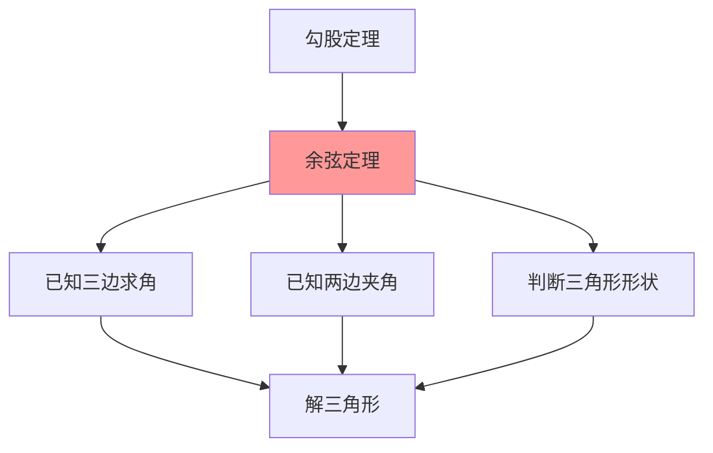

# 余弦定理的内容

---

## 一、一句话大白话速懂

**在任何三角形中，一边的平方等于另外两边平方和减去这两边乘积的2倍再乘以夹角的余弦：a² = b² + c² - 2bc·cosA。**

---

## 二、生活化场景类比

### 类比1：勾股定理的"升级版"

勾股定理：直角三角形中 $a^2 = b^2 + c^2$

余弦定理：**任意三角形**中 $a^2 = b^2 + c^2 - 2bc\cos A$

当A = 90°时，cosA = 0，余弦定理就变成了勾股定理！

### 类比2：向量点积的几何意义

两个向量的点积：$\vec{a} · \vec{b} = |\vec{a}||\vec{b}|\cos\theta$

余弦定理本质上就是向量运算的几何表达！

### 类比3：三角形的"边长计算器"

已知两边和夹角，求第三边：
- 用余弦定理，一步算出
- 就像用计算器，输入已知，输出未知

---

## 三、上帝视角本源解析

### 1. 本源：为什么要发明余弦定理？

**弥补正弦定理的不足**：
- 正弦定理：已知两角一边、两边一对角
- 但已知三边怎么办？已知两边夹角怎么办？
- 余弦定理填补了这个空白

**实际应用的需求**：
- 测量中经常知道两边和夹角
- 例如：测量河宽，可以在一边测量角度

### 2. 本质：余弦定理到底在说什么？

**本质是"边角关系"的另一种定量描述**。

正弦定理描述的是"比例关系"，余弦定理描述的是"平方关系"。

两者互补，共同构成解三角形的完整工具。

### 3. 边界：什么时候能用，什么时候不能用？

| 适用场景 | 不适用场景 |
|:---:|:---:|
| 已知三边求角 | 已知两角一边（用正弦定理） |
| 已知两边夹角求第三边 | 已知两边一对角（用正弦定理） |
| 判断三角形形状 | 不是三角形的情况 |

### 4. 体系定位

```
三角函数基础
    ↓
三角恒等变换
    ↓
正弦定理
    ↓
余弦定理 ← 你现在在这里
    ↓
解三角形综合应用
```

---

## 四、知识点精准拆解

### 4.1 余弦定理的表述

**文字表述**：
> 在任意三角形中，任何一边的平方等于其他两边平方的和减去这两边与它们夹角的余弦的积的两倍。

**符号表述**：
$$
a^2 = b^2 + c^2 - 2bc\cos A
$$
$$
b^2 = a^2 + c^2 - 2ac\cos B
$$
$$
c^2 = a^2 + b^2 - 2ab\cos C
$$

### 4.2 求角公式（变形）

由余弦定理变形得到：

$$
\cos A = \frac{b^2 + c^2 - a^2}{2bc}
$$

$$
\cos B = \frac{a^2 + c^2 - b^2}{2ac}
$$

$$
\cos C = \frac{a^2 + b^2 - c^2}{2ab}
$$

### 4.3 推导过程（向量法）

**Step 1：建立向量关系**

设 $\vec{CB} = \vec{a}$，$\vec{CA} = \vec{b}$，则 $\vec{AB} = \vec{b} - \vec{a}$

**Step 2：计算向量模的平方**

$$
c^2 = |\vec{AB}|^2 = |\vec{b} - \vec{a}|^2
$$

**Step 3：展开**

$$
c^2 = |\vec{b}|^2 + |\vec{a}|^2 - 2\vec{a} · \vec{b}
$$

**Step 4：利用点积公式**

$$
\vec{a} · \vec{b} = |\vec{a}||\vec{b}|\cos C = ab\cos C
$$

**Step 5：得出结论**

$$
c^2 = a^2 + b^2 - 2ab\cos C
$$

### 4.4 与勾股定理的关系

| 三角形类型 | 角A | cosA | 余弦定理 |
|:---:|:---:|:---:|:---:|
| 直角三角形 | 90° | 0 | $a^2 = b^2 + c^2$（勾股定理）|
| 锐角三角形 | < 90° | > 0 | $a^2 < b^2 + c^2$ |
| 钝角三角形 | > 90° | < 0 | $a^2 > b^2 + c^2$ |

**结论**：
- $a^2 = b^2 + c^2$ ⇔ A = 90°（直角三角形）
- $a^2 < b^2 + c^2$ ⇔ A < 90°（锐角三角形）
- $a^2 > b^2 + c^2$ ⇔ A > 90°（钝角三角形）

---

## 五、全体系逻辑关系



**核心功能**：
- 已知三边求角
- 已知两边夹角求第三边
- 判断三角形形状

---

## 六、零基础入门例题

### 例题1：已知两边夹角求第三边

**题目**：在△ABC中，已知b = 3，c = 4，A = 60°，求a。

**解析**：

**Step 1：确定公式**
- 已知两边b、c和夹角A
- 用余弦定理求对边a

**Step 2：代入公式**
$$
a^2 = b^2 + c^2 - 2bc\cos A
$$
$$
a^2 = 3^2 + 4^2 - 2 · 3 · 4 · \cos 60°
$$

**Step 3：计算**
$$
a^2 = 9 + 16 - 24 · \frac{1}{2}
$$
$$
a^2 = 25 - 12 = 13
$$
$$
a = \sqrt{13}
$$

---

### 例题2：已知三边求角

**题目**：在△ABC中，已知a = 2，b = 3，c = 4，求角A。

**解析**：

**Step 1：选择公式**
- 已知三边，用求角公式

**Step 2：代入公式**
$$
\cos A = \frac{b^2 + c^2 - a^2}{2bc}
$$
$$
\cos A = \frac{3^2 + 4^2 - 2^2}{2 · 3 · 4}
$$

**Step 3：计算**
$$
\cos A = \frac{9 + 16 - 4}{24} = \frac{21}{24} = \frac{7}{8}
$$

**Step 4：求角**
$$
A = \arccos\frac{7}{8}
$$

---

### 例题3：判断三角形形状

**题目**：在△ABC中，已知a = 5，b = 12，c = 13，判断三角形的形状。

**解析**：

**Step 1：检验是否为直角三角形**

检查是否满足勾股定理：
$$
a^2 + b^2 = 25 + 144 = 169 = 13^2 = c^2
$$

**Step 2：结论**

满足 $a^2 + b^2 = c^2$，所以是**直角三角形**，且C = 90°。

---

### 例题4：综合应用

**题目**：在△ABC中，已知a = 7，b = 8，c = 5，求最大角。

**解析**：

**Step 1：确定最大角**
- 大边对大角
- 最大边是b = 8
- 所以最大角是B

**Step 2：用余弦定理求角B**
$$
\cos B = \frac{a^2 + c^2 - b^2}{2ac}
$$
$$
\cos B = \frac{49 + 25 - 64}{2 · 7 · 5} = \frac{10}{70} = \frac{1}{7}
$$

**Step 3：求角**
$$
B = \arccos\frac{1}{7}
$$

---

## 七、文科生高频易错雷区

### 雷区1：公式记错

**错误**：$a^2 = b^2 + c^2 + 2bc\cos A$

**正确**：$a^2 = b^2 + c^2 - 2bc\cos A$

**记忆**：减号！（因为cosA可能为负）

### 雷区2：边与角的对应关系搞错

**错误**：$a^2 = b^2 + c^2 - 2bc\cos B$

**正确**：$a^2 = b^2 + c^2 - 2bc\cos A$

**记忆**：a对A，b对B，c对C

### 雷区3：忘记开方

**错误**：$a^2 = 13$，所以a = 13

**正确**：$a = \sqrt{13}$

### 雷区4：用错定理

**错误**：已知两边一对角，用余弦定理

**正确**：已知两边一对角，用**正弦定理**

**区分**：
- 两边夹角 → 余弦定理
- 两边一对角 → 正弦定理

---

## 八、高考考点提示

### 考查频率：⭐⭐⭐⭐⭐（必考核心）

### 常见考法：

| 题型 | 分值 | 难度 |
|:---:|:---:|:---:|
| 已知两边夹角求第三边 | 4-5分 | ⭐⭐ |
| 已知三边求角 | 4-5分 | ⭐⭐ |
| 判断三角形形状 | 4-5分 | ⭐⭐⭐ |
| 综合应用 | 4-5分 | ⭐⭐⭐ |

### 高考真题示例（改编）：

**题目**（2022全国卷）：在△ABC中，a = 3，b = 4，C = 60°，则c = ____。

**答案**：$\sqrt{13}$

**解析**：
$$
c^2 = a^2 + b^2 - 2ab\cos C = 9 + 16 - 2 · 3 · 4 · \frac{1}{2} = 25 - 12 = 13
$$
$$
c = \sqrt{13}
$$

### 备考建议：
1. 熟记余弦定理的三种形式
2. 掌握求角公式的变形
3. 学会判断三角形形状
4. 与正弦定理配合使用

---

> 📌 **学习总结**：余弦定理是勾股定理的推广，是解三角形的重要工具。记住公式$a^2 = b^2 + c^2 - 2bc\cos A$，掌握已知三边求角、已知两边夹角求第三边的方法，就能解决相关问题。
