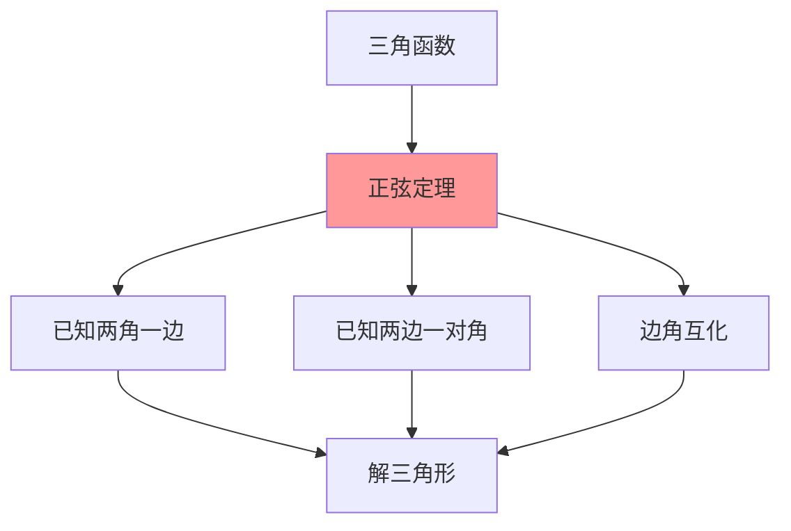

# 正弦定理的内容

---

## 一、一句话大白话速懂

**在任何三角形中，边长与对角的正弦值成正比，比例系数就是外接圆的直径：a/sinA = b/sinB = c/sinC = 2R。**

---

## 二、生活化场景类比

### 类比1：三角形中的"比例天平"

想象一个天平：
- 边a放在左边，sinA放在右边
- 边b放在左边，sinB放在右边
- 无论如何放，天平总是平衡的

这就是正弦定理：边与对角的正弦成比例！

### 类比2：外接圆的"直径密码"

每个三角形都有一个外接圆：
- 三角形的三个顶点都在圆上
- 边长与对角的正弦之比 = 圆的直径
- 这是三角形与圆的"隐藏联系"

### 类比3：三角形的"基因密码"

正弦定理揭示了三角形的内在规律：
- 边和角不是独立的
- 它们通过正弦函数紧密联系在一起
- 知道一部分，就能求出其他部分

---

## 三、上帝视角本源解析

### 1. 本源：为什么要发明正弦定理？

**解三角形的需求**：
- 已知三角形的某些边和角，求其他边和角
- 实际测量中，不可能直接测量所有量
- 需要一个工具，通过已知推未知

**实际应用**：
- 测量不可到达的距离（如河宽、山高）
- 航海定位
- 工程测量

### 2. 本质：正弦定理到底在说什么？

**本质是"边角关系"的定量描述**。

在一个三角形中：
- 大边对大角，小边对小角
- 正弦定理给出了精确的数学关系：$\frac{a}{\sin A} = \frac{b}{\sin B} = \frac{c}{\sin C}$

### 3. 边界：什么时候能用，什么时候不能用？

| 适用场景 | 不适用场景 |
|:---:|:---:|
| 已知两角一边 | 已知三边（用余弦定理更方便） |
| 已知两边及其中一边的对角 | 已知两边夹角（用余弦定理） |
| 判断三角形形状 | 不是三角形的情况 |

### 4. 体系定位

```
三角函数基础
    ↓
三角恒等变换
    ↓
正弦定理 ← 你现在在这里
    ↓
余弦定理
    ↓
解三角形综合应用
```

---

## 四、知识点精准拆解

### 4.1 正弦定理的表述

**文字表述**：
> 在任意三角形中，各边和它所对角的正弦的比相等，且等于该三角形外接圆的直径。

**符号表述**：
$$
\frac{a}{\sin A} = \frac{b}{\sin B} = \frac{c}{\sin C} = 2R
$$

其中：
- a, b, c 是三角形的三边
- A, B, C 是三边的对角
- R 是三角形外接圆的半径
- 2R 是外接圆的直径

### 4.2 变形公式

**比例形式**：
$$
a : b : c = \sin A : \sin B : \sin C
$$

**边化角**：
$$
a = 2R\sin A, \quad b = 2R\sin B, \quad c = 2R\sin C
$$

**角化边**：
$$
\sin A = \frac{a}{2R}, \quad \sin B = \frac{b}{2R}, \quad \sin C = \frac{c}{2R}
$$

### 4.3 推导过程（面积法）

**Step 1：写出三角形面积公式**

三角形ABC的面积S可以用三种方式表示：
$$
S = \frac{1}{2}bc\sin A = \frac{1}{2}ac\sin B = \frac{1}{2}ab\sin C
$$

**Step 2：等式变形**

由 $S = \frac{1}{2}bc\sin A$，得：
$$
\frac{a}{\sin A} = \frac{abc}{2S}
$$

同理：
$$
\frac{b}{\sin B} = \frac{abc}{2S}, \quad \frac{c}{\sin C} = \frac{abc}{2S}
$$

**Step 3：得出结论**

$$
\frac{a}{\sin A} = \frac{b}{\sin B} = \frac{c}{\sin C} = \frac{abc}{2S}
$$

### 4.4 外接圆直径的推导

设三角形外接圆半径为R，圆心为O。

**情况一：A为锐角**

连接BO并延长交圆于D，则BD = 2R。

∠BCD = 90°（直径所对圆周角）

∠D = ∠A（同弧所对圆周角）

在Rt△BCD中：
$$
\sin D = \frac{BC}{BD} = \frac{a}{2R}
$$

所以：
$$
\sin A = \frac{a}{2R} \Rightarrow \frac{a}{\sin A} = 2R
$$

---

## 五、全体系逻辑关系



**核心功能**：
- 实现边与角的相互转化
- 解三角形的基本工具

---

## 六、零基础入门例题

### 例题1：已知两角一边

**题目**：在△ABC中，已知A = 30°，B = 45°，a = 2，求b。

**解析**：

**Step 1：确定已知和所求**
- 已知：A = 30°，B = 45°，a = 2
- 所求：b

**Step 2：套用正弦定理**
$$
\frac{a}{\sin A} = \frac{b}{\sin B}
$$

**Step 3：代入求解**
$$
\frac{2}{\sin 30°} = \frac{b}{\sin 45°}
$$
$$
\frac{2}{\frac{1}{2}} = \frac{b}{\frac{\sqrt{2}}{2}}
$$
$$
4 = \frac{2b}{\sqrt{2}}
$$
$$
b = 2\sqrt{2}
$$

---

### 例题2：已知两边一对角

**题目**：在△ABC中，已知a = √2，b = 2，A = 30°，求B。

**解析**：

**Step 1：套用正弦定理**
$$
\frac{a}{\sin A} = \frac{b}{\sin B}
$$

**Step 2：代入求解**
$$
\frac{\sqrt{2}}{\sin 30°} = \frac{2}{\sin B}
$$
$$
\frac{\sqrt{2}}{\frac{1}{2}} = \frac{2}{\sin B}
$$
$$
2\sqrt{2} = \frac{2}{\sin B}
$$
$$
\sin B = \frac{2}{2\sqrt{2}} = \frac{\sqrt{2}}{2}
$$

**Step 3：确定B的值**
- $\sin B = \frac{\sqrt{2}}{2}$
- B = 45° 或 B = 135°

**Step 4：检验**
- 若B = 45°，A + B = 75° < 180° ✓
- 若B = 135°，A + B = 165° < 180° ✓

**答案**：B = 45° 或 B = 135°（两解）

---

### 例题3：边角互化

**题目**：在△ABC中，已知$\frac{a}{\sin A} = \frac{b}{\sin B}$，求证：a = b 当且仅当 A = B。

**解析**：

**证明**：

由正弦定理：
$$
\frac{a}{\sin A} = \frac{b}{\sin B} = 2R
$$

所以：
$$
a = 2R\sin A, \quad b = 2R\sin B
$$

**充分性**：若A = B，则$\sin A = \sin B$，所以a = b ✓

**必要性**：若a = b，则$2R\sin A = 2R\sin B$，即$\sin A = \sin B$

在三角形中，A + B < 180°，所以A = B ✓

---

### 例题4：判断三角形形状

**题目**：在△ABC中，已知$\sin A = 2\sin B\cos C$，判断三角形的形状。

**解析**：

**Step 1：用正弦定理边角互化**

由 $\sin A = \frac{a}{2R}$，$\sin B = \frac{b}{2R}$：
$$
\frac{a}{2R} = 2 · \frac{b}{2R} · \cos C
$$
$$
a = 2b\cos C
$$

**Step 2：用余弦定理**

由余弦定理：$\cos C = \frac{a^2 + b^2 - c^2}{2ab}$

代入：
$$
a = 2b · \frac{a^2 + b^2 - c^2}{2ab} = \frac{a^2 + b^2 - c^2}{a}
$$

**Step 3：化简**
$$
a^2 = a^2 + b^2 - c^2
$$
$$
b^2 = c^2
$$
$$
b = c
$$

**结论**：b = c，所以是**等腰三角形**

---

## 七、文科生高频易错雷区

### 雷区1：忘记检验解的合理性

**错误**：已知两边一对角，求出sinB后直接写B的值，不检验

**正确做法**：
- $\sin B = k$ 时，B可能有两个解（锐角和钝角）
- 必须检验：A + B < 180°？
- 还要检验：大边对大角

### 雷区2：混淆边和角的对应关系

**错误**：$\frac{a}{\sin B} = \frac{b}{\sin A}$

**正确**：$\frac{a}{\sin A} = \frac{b}{\sin B}$（边与对角对应）

**记忆**：a对A，b对B，c对C

### 雷区3：忘记2R的含义

**错误**：认为$\frac{a}{\sin A} = R$

**正确**：$\frac{a}{\sin A} = 2R$（直径，不是半径）

### 雷区4：已知两边夹角时用正弦定理

**错误**：已知a、b和C，用正弦定理求c

**正确做法**：
- 已知两边夹角，用**余弦定理**
- 正弦定理适用于：两角一边、两边一对角

---

## 八、高考考点提示

### 考查频率：⭐⭐⭐⭐⭐（必考核心）

### 常见考法：

| 题型 | 分值 | 难度 |
|:---:|:---:|:---:|
| 已知两角一边求其他 | 4-5分 | ⭐⭐ |
| 已知两边一对角 | 4-5分 | ⭐⭐⭐ |
| 边角互化 | 4-5分 | ⭐⭐⭐ |
| 判断三角形形状 | 4-5分 | ⭐⭐⭐ |

### 高考真题示例（改编）：

**题目**（2023全国卷）：在△ABC中，A = 60°，B = 45°，a = 3，则b = ____。

**答案**：$\sqrt{6}$

**解析**：
$$
\frac{a}{\sin A} = \frac{b}{\sin B}
$$
$$
\frac{3}{\sin 60°} = \frac{b}{\sin 45°}
$$
$$
\frac{3}{\frac{\sqrt{3}}{2}} = \frac{b}{\frac{\sqrt{2}}{2}}
$$
$$
b = \frac{3 · \frac{\sqrt{2}}{2}}{\frac{\sqrt{3}}{2}} = \frac{3\sqrt{2}}{\sqrt{3}} = \sqrt{6}
$$

### 备考建议：
1. 熟记正弦定理的各种形式
2. 掌握边角互化的方法
3. 注意检验解的合理性
4. 与余弦定理配合使用

---

> 📌 **学习总结**：正弦定理解三角形的核心工具。记住"边与对角的正弦成正比"，掌握边角互化的技巧，就能解决大部分解三角形问题。
