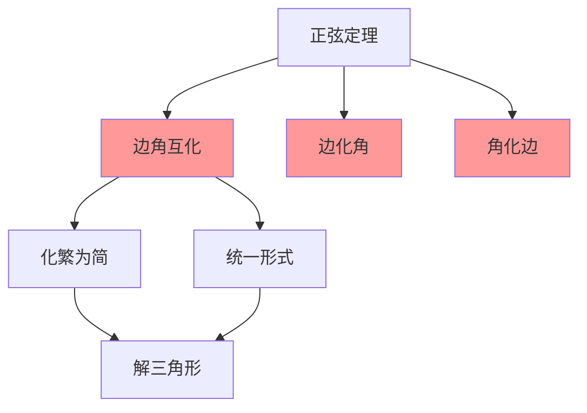

# 边角互化思想

---

## 一、一句话大白话速懂

**边角互化就是利用正弦定理和余弦定理，把三角形的"边"和"角"互相转化，让复杂的问题变成简单的问题。**

---

## 二、生活化场景类比

### 类比1：货币的兑换

去国外旅游：
- 人民币 ↔ 美元 ↔ 欧元
- 根据不同场景选择最方便的货币

边角互化就像"货币兑换"：
- 边 ↔ 角
- 根据题目条件选择最方便的形式

### 类比2：语言的翻译

- 中文 ↔ 英文
- 选择最擅长的语言来表达

边角互化就是"数学语言的翻译"：
- 把边的关系翻译成角的关系
- 或把角的关系翻译成边的关系

### 类比3：单位换算

- 米 ↔ 厘米 ↔ 千米
- 根据计算方便选择单位

边角互化就是"数学单位的换算"：
- 边和角是三角形的两种"度量"
- 通过定理互相转换

---

## 三、上帝视角本源解析

### 1. 本源：为什么要研究边角互化？

**简化问题的需求**：
- 有些问题边的条件多，化成角更方便
- 有些问题角的条件多，化成边更方便
- 互化是"化繁为简"的重要策略

**统一形式的需求**：
- 把混合条件（既有边又有角）统一成单一形式
- 便于分析和计算

### 2. 本质：边角互化的本质是什么？

**本质是"等价变换"**。

通过正弦定理和余弦定理，建立边与角之间的桥梁：
- 正弦定理：$\frac{a}{\sin A} = 2R$（边↔角的正弦）
- 余弦定理：$a^2 = b^2 + c^2 - 2bc\cos A$（边↔角的余弦）

### 3. 边界：什么时候化边，什么时候化角？

| 化角为边 | 化边为角 |
|:---:|:---:|
| 已知角的条件多 | 已知边的条件多 |
| 要判断边的关系 | 要判断角的关系 |
| 式子中角的形式复杂 | 式子中边的形式复杂 |

### 4. 体系定位

```
正弦定理
    ↓
余弦定理
    ↓
边角互化思想 ← 你现在在这里
    ↓
解三角形综合应用
    ↓
三角函数综合题
```

---

## 四、知识点精准拆解

### 4.1 正弦定理的边角互化

**边化角**：
$$
a = 2R\sin A, \quad b = 2R\sin B, \quad c = 2R\sin C
$$

**角化边**：
$$
\sin A = \frac{a}{2R}, \quad \sin B = \frac{b}{2R}, \quad \sin C = \frac{c}{2R}
$$

**比例关系**：
$$
a : b : c = \sin A : \sin B : \sin C
$$

### 4.2 余弦定理的边角互化

**边化角（求角）**：
$$
\cos A = \frac{b^2 + c^2 - a^2}{2bc}
$$

**角化边（求边）**：
$$
a^2 = b^2 + c^2 - 2bc\cos A
$$

### 4.3 互化策略

**策略一：齐次式化角**

如果等式中边的次数相同（齐次），可以化成角：

例：$a + b = 2c$ → $\sin A + \sin B = 2\sin C$

**策略二：非齐次式化边**

如果等式中角的次数复杂，可以化成边：

例：$\cos A + \cos B = \cos C$ → 用余弦定理化边

**策略三：混合式统一**

既有边又有角时，统一成一种形式：

例：$a\sin A = b\cos B$ → 可以都化角，或都化边

---

## 五、全体系逻辑关系



**核心功能**：
- 实现边与角的相互转化
- 化繁为简，统一形式

---

## 六、零基础入门例题

### 例题1：边化角

**题目**：在△ABC中，已知a + b = 2c，求证：$\sin A + \sin B = 2\sin C$。

**解析**：

**Step 1：用正弦定理边化角**

由 $a = 2R\sin A$，$b = 2R\sin B$，$c = 2R\sin C$

**Step 2：代入已知条件**
$$
2R\sin A + 2R\sin B = 2 · 2R\sin C
$$

**Step 3：化简**
$$
\sin A + \sin B = 2\sin C \quad \checkmark
$$

---

### 例题2：角化边

**题目**：在△ABC中，已知$\sin^2 A + \sin^2 B = \sin^2 C$，判断三角形形状。

**解析**：

**Step 1：用正弦定理角化边**

由 $\sin A = \frac{a}{2R}$，$\sin B = \frac{b}{2R}$，$\sin C = \frac{c}{2R}$

**Step 2：代入**
$$
\left(\frac{a}{2R}\right)^2 + \left(\frac{b}{2R}\right)^2 = \left(\frac{c}{2R}\right)^2
$$

**Step 3：化简**
$$
\frac{a^2}{4R^2} + \frac{b^2}{4R^2} = \frac{c^2}{4R^2}
$$
$$
a^2 + b^2 = c^2
$$

**结论**：满足勾股定理，是**直角三角形**，C = 90°

---

### 例题3：边角混合的化简

**题目**：在△ABC中，化简：$\frac{a\cos B + b\cos A}{c}$

**解析**：

**方法一：边化角**

由正弦定理：$a = 2R\sin A$，$b = 2R\sin B$，$c = 2R\sin C$

$$
\text{原式} = \frac{2R\sin A\cos B + 2R\sin B\cos A}{2R\sin C}
$$
$$
= \frac{\sin A\cos B + \sin B\cos A}{\sin C}
$$
$$
= \frac{\sin(A + B)}{\sin C}
$$

因为 $A + B + C = 180°$，所以 $A + B = 180° - C$

$$
= \frac{\sin(180° - C)}{\sin C} = \frac{\sin C}{\sin C} = 1
$$

**方法二：角化边（用余弦定理）**

$$
\cos B = \frac{a^2 + c^2 - b^2}{2ac}, \quad \cos A = \frac{b^2 + c^2 - a^2}{2bc}
$$

代入：
$$
a\cos B + b\cos A = a · \frac{a^2 + c^2 - b^2}{2ac} + b · \frac{b^2 + c^2 - a^2}{2bc}
$$
$$
= \frac{a^2 + c^2 - b^2}{2c} + \frac{b^2 + c^2 - a^2}{2c}
$$
$$
= \frac{a^2 + c^2 - b^2 + b^2 + c^2 - a^2}{2c} = \frac{2c^2}{2c} = c
$$

所以：
$$
\frac{a\cos B + b\cos A}{c} = \frac{c}{c} = 1
$$

---

### 例题4：综合应用

**题目**：在△ABC中，已知$\cos A = \frac{b}{c}$，判断三角形形状。

**解析**：

**Step 1：角化边**

由余弦定理：
$$
\cos A = \frac{b^2 + c^2 - a^2}{2bc}
$$

**Step 2：代入已知条件**
$$
\frac{b^2 + c^2 - a^2}{2bc} = \frac{b}{c}
$$

**Step 3：化简**
$$
b^2 + c^2 - a^2 = 2b^2
$$
$$
c^2 - a^2 = b^2
$$
$$
c^2 = a^2 + b^2
$$

**结论**：满足勾股定理，是**直角三角形**，C = 90°

---

## 七、文科生高频易错雷区

### 雷区1：互化时忘记2R

**错误**：$a = \sin A$

**正确**：$a = 2R\sin A$

**注意**：2R在比例中可以消去，但在非比例式中不能忽略

### 雷区2：混淆正弦和余弦的互化

**错误**：用正弦定理化$\cos A$

**正确**：
- 化$\sin A$ → 用正弦定理
- 化$\cos A$ → 用余弦定理

### 雷区3：齐次式判断错误

**错误**：$a + b^2 = c$ 是齐次式

**正确**：齐次式要求各项次数相同
- $a + b = 2c$ 是齐次式（都是1次）
- $a^2 + b^2 = c^2$ 是齐次式（都是2次）
- $a + b^2 = c$ 不是齐次式

### 雷区4：忘记三角形内角和

**错误**：$\sin(A + B) = \sin A + \sin B$

**正确**：
- $A + B + C = 180°$
- $A + B = 180° - C$
- $\sin(A + B) = \sin(180° - C) = \sin C$

---

## 八、高考考点提示

### 考查频率：⭐⭐⭐⭐⭐（必考核心）

### 常见考法：

| 题型 | 分值 | 难度 |
|:---:|:---:|:---:|
| 边化角求值 | 4-5分 | ⭐⭐ |
| 角化边判断形状 | 4-5分 | ⭐⭐⭐ |
| 综合化简 | 4-5分 | ⭐⭐⭐ |

### 高考真题示例（改编）：

**题目**（2022全国卷）：在△ABC中，已知$2\sin A\cos B = \sin C$，求证：a = b。

**答案**：见解析

**解析**：

**方法一：角化边**

由 $\sin C = \sin(A + B) = \sin A\cos B + \cos A\sin B$

代入已知：
$$
2\sin A\cos B = \sin A\cos B + \cos A\sin B
$$
$$
\sin A\cos B = \cos A\sin B
$$
$$
\sin A\cos B - \cos A\sin B = 0
$$
$$
\sin(A - B) = 0
$$

因为 $-180° < A - B < 180°$，所以 $A - B = 0$，即 $A = B$

所以 a = b（等角对等边）

### 备考建议：
1. 熟练掌握正弦定理和余弦定理的互化形式
2. 学会判断何时化边、何时化角
3. 注意齐次式的识别和应用
4. 牢记三角形内角和为180°

---

> 📌 **学习总结**：边角互化是解三角形的核心思想。记住"正弦定理化正弦，余弦定理化余弦"，根据题目条件灵活选择互化方向，就能化繁为简，解决问题。
